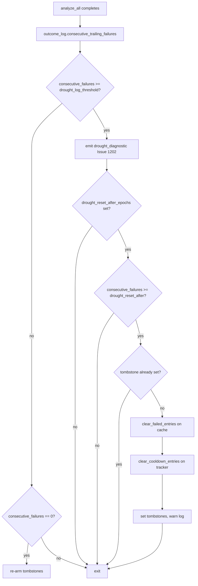

# Issue #1205 — Operator drought-reset escape hatch

## Summary

Adds an operator-controlled environment variable
`NEAT_AI_DISCOVERY_DROUGHT_RESET_AFTER_EPOCHS` that, when set, forces a
one-shot reset of the failed candidate cache entries and the target
failure cooldown tracker after a configurable number of consecutive empty
discovery passes. This is the final escape hatch after adaptive
staleness (#1203) and adaptive cooldown (#1204) have already relaxed the
suppression layers and the pipeline is still stuck.

Successful per-source-type statistics and below-threshold tracker entries
are preserved — the reset is surgical, not a restart. A tombstone field
on both structures (`CandidateOutcomeCache.tombstone_reset_epoch` and
`TargetFailureTracker.tombstone_reset_epoch`) guarantees the same
consecutive-failure streak triggers at most one reset, and a successful
outcome re-arms the lever.

Closes #1205.

## Evidence

This change is purely backend (Rust library — no UI surface). Behaviour
is verified through unit and integration tests.

### Flow

### Verification

- `cargo test --lib -- target_failure_tracker drought_reset` — 20 passed.
- `cargo test --test issue_1205_drought_reset_escape_hatch` — 3 passed.
- `cargo test --test scoring -- issue_465` — 26 passed (existing tests
  plus six new cases for `clear_failed_entries` and tombstone semantics).
- `./quality.sh` — all checks pass (fmt, clippy `-D warnings`, full test
  suite, doc build, release build).

## Test Plan

- `tests/issue_1205_drought_reset_escape_hatch.rs` — three integration
  scenarios:
  - **Twelve forced-empty passes with threshold 10** — reset fires
    exactly once at pass 10, leaves passes 11 and 12 untouched, preserves
    successful cache entries and source-type stats, sets tombstones on
    both structures.
  - **Successful pass re-arms the lever** — after the first reset and a
    success on each structure, a second drought triggers a second reset.
  - **Disabled lever** — when `drought_reset_after = 0`, the reset never
    fires across 50 forced-empty passes.
- `src/analysis/drought_reset.rs` — six unit tests cover the disabled,
  below-threshold, at-threshold, idempotent-second-call, re-arm, and
  cache-omitted code paths.
- `src/analysis/target_failure_tracker.rs` — five new unit tests cover
  `clear_cooldown_entries` empty / mixed / all-in-cooldown,
  `record_success` clears tombstone, explicit
  `clear_drought_reset_tombstone`.
- `tests/scoring/issue_465_candidate_outcome_cache.rs` — six new tests
  for `clear_failed_entries` (empty / mixed / all-failed / all-success)
  and the success/failure tombstone clearing rules.

## Acceptance Criteria

- [x] Env var `NEAT_AI_DISCOVERY_DROUGHT_RESET_AFTER_EPOCHS` documented in
      README and `src/config`.
- [x] `clear_failed_entries(current_epoch) -> usize` exists on
      `CandidateOutcomeCache` with unit tests for empty, mixed, all-failed,
      and all-success states.
- [x] `clear_cooldown_entries(current_epoch) -> usize` exists on
      `TargetFailureTracker` with unit tests covering the same shapes.
- [x] One-shot reset within a streak — second reset only fires after a
      successful pass clears the tombstone (covered by
      `successful_pass_rearms_lever_for_next_drought` and
      `second_call_within_streak_is_noop`).
- [x] `tracing::warn!` reports counts cleared per structure; the
      diagnostic from #1202 reflects the new (smaller) cache size on the
      following pass (the diagnostic uses `suppressed_count` which is
      computed live, so the next call observes the cleared cache).
- [x] Integration test verifies the one-shot semantics and that
      source-type stats survive the reset.
- [x] `./quality.sh` passes.
