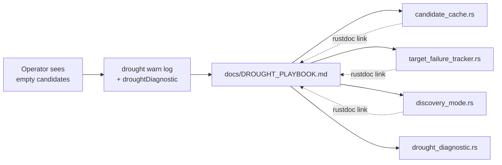

## Summary

Added `docs/DROUGHT_PLAYBOOK.md` — an operator playbook consolidating the
suppression layers, regimes, and env vars that drive the "no successful
candidates for a while" symptom into a single diagnostic lookup. Linked the
playbook from the README and from the rustdoc on the three modules that
implement the behaviour. Closes #1206.

The playbook covers:

- Symptoms (log examples + `droughtDiagnostic` shape).
- Suppression-layer interaction (Mermaid flowchart of
  cache → cooldown → conservative-mode bias → post-processing rejection).
- Diagnostic walkthrough for every field of the `droughtDiagnostic` payload
  from Issue #1202, with the lever each field points at.
- Adaptive responses — the Normal / Conservative / Extended Drought regimes
  from Issue #1132 and the adaptive staleness window from Issue #1203, with
  a Mermaid state diagram of the regime transitions.
- Operator levers — table of every relevant env var with default, range, and
  when to change it.
- Worked 30-epoch drought example walking through each regime transition
  and what the operator should look at.

Issue #1204 (adaptive target-cooldown relaxation) is still open; the playbook
notes this and documents the existing static cooldown env vars
(`NEAT_AI_DISCOVERY_TARGET_COOLDOWN_FAILURES` / `_EPOCHS`) plus the
operator escape hatch (`NEAT_AI_DISCOVERY_DROUGHT_RESET_AFTER_EPOCHS` from
#1205) as the path covering the worst case until #1204 lands. All other
env var names and defaults match the actual constants in `src/config/` and
`src/analysis/constants/`.

## Evidence

This is a documentation change with no UI or runtime behaviour modification.

- `./quality.sh` passes locally: shellcheck, `cargo deny check`, `cargo build`,
  `cargo fmt`, `cargo clippy --all-targets --all-features -- -D warnings`,
  `cargo check`, `cargo test --lib --tests --all-features`,
  `RUSTDOCFLAGS=-D warnings cargo doc --no-deps`, and release build.
- `markdownlint-cli2 docs/DROUGHT_PLAYBOOK.md` reports 0 errors.
- Both Mermaid blocks (a `flowchart LR` for the suppression layers and a
  `stateDiagram-v2` for the three regimes) use canonical syntax and render in
  GitHub's native Mermaid preview.

Architectural overview of where the playbook sits in the docs tree:

## Test Plan

No code paths were changed — existing tests cover the underlying behaviour
(cooldown threshold transitions, conservative-mode bias, adaptive staleness
window, drought diagnostic emission). The pre-existing suites that gate the
documented behaviour are:

- `src/analysis/discovery_mode.rs` — mode transition tests.
- `src/analysis/candidate_cache.rs` — adaptive window and suppression tests.
- `src/analysis/target_failure_tracker.rs` — cooldown threshold tests.
- `src/analysis/drought_diagnostic.rs` — diagnostic emission tests.

All pass under `./quality.sh`.
