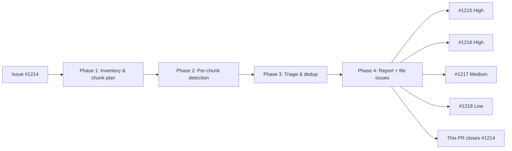

# PR Summary — Issue #1214: Run security-scan on NEAT-AI-Discovery

## Summary

Performed the MythOS-style four-phase security-in-depth audit defined by
`prompts/security_scan/v1.md` against this repository. Four evidence-backed
findings were filed as new security issues. No source code was modified;
this PR exists only to record the audit and close the idle-task issue.

Closes #1214.

## Findings filed

| Issue | Severity | Class | Title |
|-------|----------|-------|-------|
| [#1215](https://github.com/stSoftwareAU/NEAT-AI-Discovery/issues/1215) | High | supply-chain:unpinned-actions | `ludeeus/action-shellcheck` pinned to mutable `@master` branch |
| [#1216](https://github.com/stSoftwareAU/NEAT-AI-Discovery/issues/1216) | High | supply-chain:unpinned-actions | GitHub Actions pinned to mutable version tags rather than commit SHAs |
| [#1217](https://github.com/stSoftwareAU/NEAT-AI-Discovery/issues/1217) | Medium | supply-chain:no-integrity-check | `gitleaks` binary downloaded without SHA-256 or signature verification |
| [#1218](https://github.com/stSoftwareAU/NEAT-AI-Discovery/issues/1218) | Low | dangerous-default:path-without-allowlist | `clean_orphaned_discovery_dirs` accepts arbitrary `baseDir` without allowlist (defence-in-depth) |

## Machine-readable findings

```json
{
  "schema": "mythos-security-scan/v1",
  "repo": "stSoftwareAU/NEAT-AI-Discovery",
  "scanStartedAt": "2026-05-17T00:00:00Z",
  "scanFinishedAt": "2026-05-17T00:30:00Z",
  "coverage": {
    "chunksPlanned": 5,
    "chunksAudited": 5,
    "filesRead": 18
  },
  "findings": [
    {
      "id": "f1-shellcheck-master",
      "class": "supply-chain:unpinned-actions",
      "severity": "High",
      "severityRationale": "AV:N/AC:L/PR:N/UI:N/S:C/C:H/I:H/A:H — upstream master commit runs in CI with GITHUB_TOKEN access.",
      "confidence": "high",
      "confidenceLift": "Reproducer that re-points the upstream master ref and observes execution in this repo's CI.",
      "easeOfExploit": "hard",
      "easeOfExploitRationale": "Requires upstream maintainer compromise; trivial after that.",
      "file": ".github/workflows/shellcheck.yml",
      "lines": ["18-24"],
      "attackerModel": "Attacker with push access to ludeeus/action-shellcheck master branch.",
      "trigger": "Any pull request triggers the ShellCheck workflow which checks out the action at whatever commit master currently points to.",
      "whyItIsABug": "uses: ludeeus/action-shellcheck@master resolves to a mutable branch; any malicious push to upstream master executes here with GITHUB_TOKEN.",
      "exploitSketch": "1. Compromise ludeeus/action-shellcheck. 2. Push malicious commit to master that exfiltrates GITHUB_TOKEN. 3. Next PR opens; ShellCheck workflow fires; token leaked.",
      "fixSuggestion": "Pin to a 40-character commit SHA with a trailing version comment; maintain via Renovate/Dependabot."
    },
    {
      "id": "f2-actions-mutable-tags",
      "class": "supply-chain:unpinned-actions",
      "severity": "High",
      "severityRationale": "AV:N/AC:H/PR:N/UI:N/S:C/C:H/I:H/A:H — tj-actions/changed-files March 2025 incident demonstrates real-world impact.",
      "confidence": "high",
      "confidenceLift": "Reproducer demonstrating tag re-pointing on a controlled action.",
      "easeOfExploit": "hard",
      "easeOfExploitRationale": "Upstream-compromise prerequisite is hard; once met, trivial.",
      "file": ".github/workflows/ci.yml",
      "lines": [
        ".github/workflows/ci.yml:37",
        ".github/workflows/ci.yml:56",
        ".github/workflows/ci.yml:149",
        ".github/workflows/ci.yml:173",
        ".github/workflows/ci.yml:184",
        ".github/workflows/ci.yml:240",
        ".github/workflows/ci.yml:315",
        ".github/workflows/ci.yml:341",
        ".github/workflows/ci.yml:381",
        ".github/workflows/ci.yml:388",
        ".github/workflows/security.yml:22",
        ".github/workflows/security.yml:25",
        ".github/workflows/security.yml:36",
        ".github/workflows/security.yml:42",
        ".github/workflows/gitleaks.yml:14",
        ".github/workflows/semgrep.yml:16",
        ".github/workflows/cargo-quality.yml:23",
        ".github/workflows/cargo-quality.yml:26",
        ".github/workflows/cargo-quality.yml:38",
        ".github/workflows/cargo-quality.yml:44",
        ".github/workflows/upgrade-dependencies.yml:21",
        ".github/workflows/upgrade-dependencies.yml:27",
        ".github/workflows/upgrade-dependencies.yml:71"
      ],
      "attackerModel": "Attacker with push access to any upstream action repository.",
      "trigger": "Every pull request and several scheduled jobs.",
      "whyItIsABug": "References like @v4 and @stable are mutable; upstream tag rewrite re-points to malicious commits, executed in CI with GITHUB_TOKEN (and ACTIONS_PUSH PAT in version-increment job).",
      "exploitSketch": "1. Compromise actions/checkout. 2. Re-tag v4 to a malicious commit. 3. Next PR triggers ci.yml; ACTIONS_PUSH PAT leaked; attacker pushes to Develop bypassing branch protection.",
      "fixSuggestion": "Replace every @v* / @stable / @master / @<label> with a 40-character commit SHA and a trailing version comment. Configure Renovate/Dependabot to keep SHA pins current."
    },
    {
      "id": "f3-gitleaks-no-integrity",
      "class": "supply-chain:no-integrity-check",
      "severity": "Medium",
      "severityRationale": "AV:N/AC:H/PR:N/UI:N/S:U/C:H/I:H/A:N — HTTPS mitigates passive MitM but release-artefact tampering is in scope.",
      "confidence": "high",
      "confidenceLift": "Demonstration of artefact substitution in a controlled mirror.",
      "easeOfExploit": "hard",
      "easeOfExploitRationale": "Requires gitleaks release-artefact tampering.",
      "file": ".github/workflows/gitleaks.yml",
      "lines": ["15-22"],
      "attackerModel": "Attacker who can replace the gitleaks GitHub release tarball.",
      "trigger": "Every pull request runs the gitleaks workflow which downloads and executes the binary.",
      "whyItIsABug": "wget … | tar | mv chain trusts whatever the URL serves; no SHA-256 or signature verification before extraction.",
      "exploitSketch": "1. Replace gitleaks 8.24.3 tarball with backdoored binary. 2. CI runs the binary against full repo history. 3. Backdoor exfiltrates GITHUB_TOKEN and any secret hit during the scan.",
      "fixSuggestion": "Pin and verify a SHA-256 of the artefact (`sha256sum -c`) before extracting, or switch to a SHA-pinned gitleaks GitHub Action; even better, use cosign signature verification."
    },
    {
      "id": "f4-cleanup-no-allowlist",
      "class": "dangerous-default:path-without-allowlist",
      "severity": "Low",
      "severityRationale": "AV:L/AC:H/PR:L/UI:N/S:U/C:N/I:H/A:H — defence-in-depth; not exploitable across current trust boundary.",
      "confidence": "high",
      "confidenceLift": "Reproducer demonstrating a controller bug that propagates user input into baseDir.",
      "easeOfExploit": "hard",
      "easeOfExploitRationale": "Requires a controller-side regression or operator misconfiguration.",
      "file": "src/discovery_cleanup.rs",
      "lines": ["111-186", "src/ffi/utilities.rs:473-549"],
      "attackerModel": "Future bug in the Deno controller or operator misconfiguration that points baseDir at $HOME or /tmp.",
      "trigger": "FFI call clean_orphaned_discovery_dirs({\"baseDir\":\"/tmp\"}).",
      "whyItIsABug": "is_directory_orphaned only checks for the discovery.lock file; any subdirectory of baseDir lacking that file is treated as orphan and removed with fs::remove_dir_all. No prefix/allowlist check on baseDir, no session-name pattern check on the subdirectory.",
      "exploitSketch": "1. Future controller change derives baseDir from a tainted tempDir field. 2. Operator runs cleanup. 3. /tmp/* subdirs without discovery.lock are recursively deleted.",
      "fixSuggestion": "Require baseDir to contain a marker like .discovery, and require each subdirectory's name to match a discovery session pattern (UUID or `discovery-*` prefix) before treating its missing lock as orphan evidence."
    }
  ]
}
```

## Evidence

This is a static read-only audit; no UI to screenshot and no functional code changes. Evidence for each finding is cited inline in the corresponding issue (sub-issues above), with file paths and line ranges pointing at the offending YAML or Rust source.

Audit flow:



## Coverage map

| Chunk | Files audited | Outcome |
|-------|---------------|---------|
| GitHub Actions workflows | `.github/workflows/*.yml` (8 files) | 3 findings (#1215, #1216, #1217) |
| FFI boundary | `src/ffi/mod.rs`, `src/ffi/helpers.rs`, `src/ffi/recording.rs`, `src/ffi/utilities.rs` | 1 finding (#1218) |
| File / path handling | `src/discovery_cleanup.rs` and FFI utilities entries | 1 finding (#1218, same root cause) |
| Unsafe Rust & FFI memory mgmt | 15 files via grep for `unsafe` blocks; spot-checked `src/ffi/*.rs` | Clean — all panics caught at the boundary, `to_ffi_json`/`ffi_error_literal` handle CString failures gracefully |
| Build / install scripts | `quality.sh`, `scripts/runlib.sh` | Clean — `curl \| sh` for rustup install is the canonical upstream pattern with `--proto =https --tlsv1.2`; flagged informally below |
| Cargo dependencies & licences | `Cargo.toml`, `deny.toml` | Clean — `cargo-deny` enforces licence allowlist and registry pinning; one known-unmaintained advisory (`paste` / RUSTSEC-2024-0436) is justifiably ignored |
| Secrets in source | `grep -i password\|api_key\|secret\|token\|BEGIN.*PRIVATE` across `src/` | Clean — no hits |
| Crypto misuse | `grep -i md5\|sha1\|Math\.random\|HMAC\|crypto` across `src/` | Clean — no cryptographic primitives used in repo logic |

## Suggested next scans

- **Dependency audit run**: `cargo audit` is in CI but its findings are not tracked in this scan. A periodic audit-against-RustSec-DB pass would catch newly-disclosed advisories in transitive deps (e.g. `wgpu-hal`, `parquet`).
- **Fuzzing pass on FFI JSON input**: every FFI entry parses `serde_json` from untrusted bytes; a `cargo-fuzz` target on `record_discovery_internal` and the streaming session entries would harden the parsing surface.
- **Permissions review of `ACTIONS_PUSH` PAT**: the `version-increment` job pushes to PR branches with this PAT; once SHA-pinning lands (per #1216), confirm the PAT scope is the narrowest workable.
- **Symlink-handling review of `cleanup_discovery_dir`**: separately from #1218, confirm `fs::remove_dir_all` on a tree containing symlinks-to-directories behaves safely on the supported platforms (Linux + macOS); this changed across Rust releases.

## Test plan

- [x] All four findings filed against `stSoftwareAU/NEAT-AI-Discovery` with the `security` label (created during this run).
- [x] No source files in the repo modified (`git status` is clean except this PR summary).
- [x] PR targets `milestone/idle-task-security-scan` per the issue instructions.
- [x] Issue references included so #1214 auto-closes on merge.
