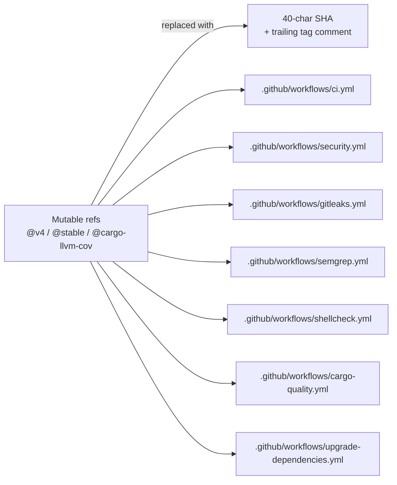

# Pin all GitHub Actions to immutable commit SHAs (Issue #1216)

## Summary

Replace every mutable `@v4` / `@stable` / `@cargo-llvm-cov` / `@v6` /
`@v7` reference across `.github/workflows/` with the 40-character commit
SHA of the released version, keeping the human-readable tag in a
trailing comment. Mutable refs are silently re-pointable by an attacker
that compromises an upstream action repo (cf. `tj-actions/changed-files`,
March 2025), and would execute in this repository's CI with access to
`GITHUB_TOKEN` and the `ACTIONS_PUSH` PAT. Closes #1216.

## Evidence

This is a CI / configuration change with no runtime surface, so no UI
screenshot or runtime benchmark applies. Verification is by:

1. A new integration test, `tests/issue_1216_workflow_sha_pins.rs`,
   parses every `*.yml` under `.github/workflows/` and asserts that each
   `uses:` ref is a 40-character lower-case hex commit SHA. Local
   reusable-workflow refs (`./.github/workflows/...`) are exempt.
   Before this change the test fails listing 21 unpinned references;
   after the change it passes.
2. `./quality.sh` passes cleanly (fmt, clippy, check, test, doc, release
   build).

### Actions pinned

| Action | SHA | Tag |
|--------|-----|-----|
| `actions/checkout` | `11bd71901bbe5b1630ceea73d27597364c9af683` | v4.2.2 |
| `actions/checkout` | `de0fac2e4500dabe0009e67214ff5f5447ce83dd` | v6.0.2 |
| `actions/cache` | `0057852bfaa89a56745cba8c7296529d2fc39830` | v4.3.0 |
| `dtolnay/rust-toolchain` (stable branch) | `29eef336d9b2848a0b548edc03f92a220660cdb8` | stable |
| `codespell-project/actions-codespell` | `8f01853be192eb0f849a5c7d721450e7a467c579` | v2.2 |
| `rustsec/audit-check` | `69366f33c96575abad1ee0dba8212993eecbe998` | v2.0.0 |
| `actions/dependency-review-action` | `595b5aeba73380359d98a5e087f648dbb0edce1b` | v4.7.3 |
| `taiki-e/install-action` (now with `with: tool: cargo-llvm-cov`) | `7be9fd86bd1707236395105d6e9329dd1511a7e1` | v2.79.0 |
| `codecov/codecov-action` | `0f8570b1a125f4937846a11fcfa3bcd548bd8c97` | v4.6.0 |
| `peter-evans/create-pull-request` | `22a9089034f40e5a961c8808d113e2c98fb63676` | v7.0.11 |

### Files touched

`taiki-e/install-action@cargo-llvm-cov` was using a mutable shorthand
tag; this PR moves to the official `v2.79.0` release SHA and adds
`with: tool: cargo-llvm-cov` to keep behaviour identical.

`dtolnay/rust-toolchain@stable` is pinned to the SHA of the action's
`stable` branch (`29eef336…`). That branch's `action.yml` defaults the
`toolchain` input to `stable`, so the behaviour with the SHA pin is
identical to `@stable` but the ref is now immutable.

## Test Plan

- Added `tests/issue_1216_workflow_sha_pins.rs::all_workflow_actions_are_pinned_to_commit_sha`,
  which scans `.github/workflows/*.yml` for `uses:` references and
  asserts each is pinned to a 40-character commit SHA.
- `cargo test --test issue_1216_workflow_sha_pins` passes after the
  change; the same test fails on the pre-change tree, demonstrating it
  exercises the new behaviour.
- `./quality.sh` passes end-to-end.
- No runtime code is changed, so existing test suites continue to apply
  unchanged.
