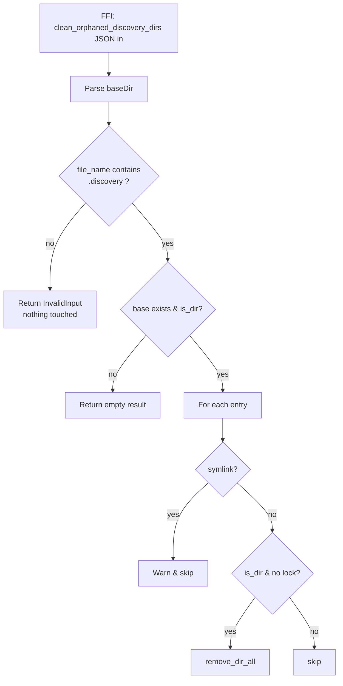

# Defence-in-depth allowlist for `clean_orphaned_discovery_dirs`

## Summary

`clean_orphaned_discovery_dirs` recursively removes every subdirectory of
its `base_dir` argument that lacks a `discovery.lock` file. Before this
change there was no validation that `base_dir` actually pointed at a
discovery root, so a future caller bug or misconfiguration that derived
`base_dir` from an untrusted source (e.g. defaulting to `os.tmpdir()`,
`$HOME`, or `/var/folders/...`) would mass-delete unrelated
subdirectories.

This change adds two defence-in-depth gates at the boundary, leaving
the trust contract with the Deno/NEAT-AI controller unchanged but
localising the blast radius if that contract is ever broken:

1. **Entry-point allowlist** — the final path component of `base_dir`
   must contain the marker `.discovery`. Otherwise the call returns
   `io::ErrorKind::InvalidInput` and touches nothing. `/`, `/tmp`,
   `$HOME`, `/var/folders/...` and any other non-discovery path are
   rejected before the scan starts.
2. **Symlink skip during iteration** — directory entries that are
   symlinks are logged and skipped. `fs::remove_dir_all` on a symlinked
   directory has had platform / version dependent behaviour in the past
   (deleting the link target's contents); discovery sessions never
   create symlinked roots so a symlink here is always anomalous.

Closes #1218.

## Evidence

Backend-only change (Rust FFI library), no UI to screenshot. Verified
by:

- `cargo test --lib discovery_cleanup` — all 16 tests pass, including
  five new tests that exercise the new gates.
- `./quality.sh` — full quality gate passes (fmt, clippy, check, tests,
  doc build, release build).

## Test Plan

Tests added or modified in `src/discovery_cleanup.rs`:

- **New `test_orphan_scan_rejects_non_discovery_root`** — a real
  directory whose name does not contain `.discovery` returns
  `InvalidInput` and a populated victim subdirectory survives.
- **New `test_orphan_scan_rejects_root_and_tmp`** — spot-checks `/`,
  `/tmp`, `/var/folders/xx` are all rejected with `InvalidInput`.
- **New `test_orphan_scan_accepts_suffixed_discovery_root`** — confirms
  the marker is a `contains` check, so `my-project.discovery` and
  `.discovery-cache` are both accepted.
- **New `test_orphan_scan_skips_symlinked_subdirs`** (unix-only) —
  symlink inside a discovery root pointing at an outside directory is
  skipped, target survives with its file intact.
- **Updated** `test_orphan_scan_removes_only_orphaned_dirs`,
  `test_orphan_scan_nonexistent_base_dir`, `test_orphan_scan_empty_base_dir`,
  `test_orphan_scan_skips_files`, `test_concurrent_orphan_scan_with_async_cleanup`,
  `test_multiple_orphaned_dirs_cleaned` — now run inside a `.discovery`
  child of `TempDir` so they satisfy the new allowlist. Original
  assertions are preserved; no test was removed or skipped.

Cargo.toml patch version bumped `0.74.48` → `0.74.49` per the
repository's version-on-every-change rule.
