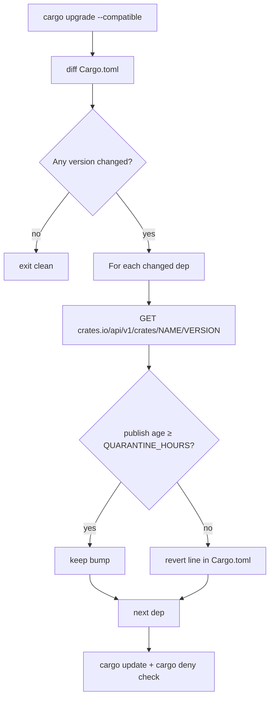

## Summary

Closes #1234. The `bump-deps.sh` header documented a 24h quarantine
window (`VIBE_BUMP_QUARANTINE_HOURS`) intended to dodge fast-flagged
supply-chain attacks, but the variable was never read from the upgrade
path. The scheduled `upgrade-dependencies.yml` workflow called
`cargo upgrade` directly with no age gate. A poisoned crates.io release
published seconds before the Monday cron would land in `Cargo.toml`
before RustSec advisories caught it.

This PR makes the declared policy real on two layers:

- **Renovate config (`renovate.json`)** — defence-in-depth gate. Sets
  `minimumReleaseAge: "24h"` for every cargo and GitHub-Actions package,
  with an explicit exception for `stSoftwareAU/*` first-party sources so
  future internal deps inherit the immediate-bump policy automatically.
- **`bump-deps.sh` enforcement** — after `cargo upgrade --compatible`,
  the script diffs `Cargo.toml`, queries the crates.io API
  (`/api/v1/crates/<name>/<version>`) for each bumped dependency's
  publish time, and reverts any bump younger than the configured
  window via `bump_deps::revert_dep_line`. The existing
  `bump_deps::is_quarantine_expired` helper is now actually reached.
- **`upgrade-dependencies.yml`** — the weekly workflow now invokes
  `./bump-deps.sh` instead of calling `cargo upgrade` directly, so the
  same gate applies on the scheduled path.

## Evidence

This is a CLI/config change with no UI surface. Evidence is the test
output: 48 bash test cases pass (up from 36) covering the new helpers,
plus 3 new Rust tests asserting the configuration contract.

Flow of an external bump after the change:

Behaviour matrix:

| Trigger                               | Before this PR                                 | After this PR                                                                     |
| ------------------------------------- | ---------------------------------------------- | --------------------------------------------------------------------------------- |
| `./bump-deps.sh` (no flags)           | runs `cargo upgrade --compatible`, no age gate | runs the same upgrade, then reverts any bump &lt; `VIBE_BUMP_QUARANTINE_HOURS` old   |
| `./bump-deps.sh --no-network`         | already a no-op for external bumps             | unchanged (no-op)                                                                 |
| `./bump-deps.sh --dry-run`            | already a no-op for `Cargo.toml`               | unchanged                                                                         |
| Weekly `upgrade-dependencies.yml` cron | called `cargo upgrade` directly, no gate       | calls `./bump-deps.sh`, picks up the gate                                         |
| Renovate (if enabled on the repo)     | no config; default behaviour                   | external cargo & github-actions held &ge; 24h; `stSoftwareAU/*` bypasses the wait |

## Test Plan

- `tests/bump_deps_test.sh` — added six new test groups (14–19):
  - Test 14: `extract_dep_versions` parses inline and inline-table form.
  - Test 15: `compute_changed_deps` emits only changed deps.
  - Test 16: `revert_dep_line` restores the old version string,
    including inline-table form, without touching unrelated lines.
  - Tests 17–18: `fetch_publish_epoch` reads the test-seam fixture and
    returns non-zero when the fixture is missing.
  - Test 19: `current_epoch` honours the `BUMP_DEPS_NOW_EPOCH` stub.
- `tests/issue_1234_quarantine_enforcement.rs` — three new tests:
  - `renovate.json` is present and sets `minimumReleaseAge: "24h"`
    with the `stSoftwareAU` exception documented.
  - `upgrade-dependencies.yml` invokes `./bump-deps.sh`.
  - `bump-deps.sh` calls the crates.io API and reverts in-quarantine
    bumps (no longer dead plumbing).
- `./quality.sh < /dev/null` passes end-to-end (shellcheck, clippy,
  cargo test, cargo deny, release build).
