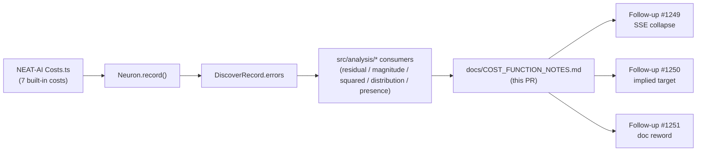

## Summary

Audited every consumer of `DiscoverRecord.errors` under `src/analysis/` and
documented the cost-agnostic invariants discovery depends on. The audit lives
at `docs/COST_FUNCTION_NOTES.md` and catalogues each error-consuming site with
a file:line reference, a residual/magnitude/squared/distribution/presence
classification, and a per-cost validity matrix covering all seven built-in
NEAT-AI costs (`MSE`, `MAE`, `MAPE`, `MSLE`, `HINGE`, `CROSS_ENTROPY`,
`CATEGORICAL_ERROR`).

The audit surfaced three concrete defects, all triggered by the newly added
`CATEGORICAL_ERROR` cost (NEAT-AI PR #2739). Each is filed as a follow-up so
the audit can land cleanly as documentation:

- #1249 — SSE-improvement ratio collapses for `{0, 1}` errors
- #1250 — `activation + error = implied target` invalid for non-linear-residual costs
- #1251 — `docs/discoveries/add-neuron.md:56` overclaims MSE-specific behaviour

No source code is modified — this PR is documentation-only, by design.

Closes #1245.

## Evidence

This is a documentation-only change with no UI, no performance impact, and no
new functions. Evidence is the audit document itself:

- `docs/COST_FUNCTION_NOTES.md` lists every error-consuming module in
  `src/analysis/` with file:line accuracy.
- Each module is classified
  (`RESIDUAL` / `MAGNITUDE` / `SQUARED` / `DISTRIBUTION` / `PRESENCE`) with
  per-cost validity flags (✅ / ⚠️ / ❌).
- Three concrete defects are filed as follow-up issues (#1249, #1250, #1251)
  with reproduction sites linked back to the audit doc.

Quality gate ran via `./quality.sh < /dev/null` and markdown linting via
`markdownlint-cli2 docs/COST_FUNCTION_NOTES.md` to confirm the doc passes the
repo's lint configuration.

## Test Plan

This PR adds no functional changes, so no new tests are added. Verification:

- [x] `markdownlint-cli2 docs/COST_FUNCTION_NOTES.md` passes (0 errors).
- [x] `./quality.sh < /dev/null` passes (full build / clippy / cargo test).
- [x] Every file:line reference in the audit was cross-checked against the
      current `src/` tree via `rg`.
- [x] Three follow-up issues filed (#1249, #1250, #1251) with reproduction
      pointers back to the audit.

## Acceptance Criteria

- [x] `docs/COST_FUNCTION_NOTES.md` exists and lists every error-consuming
      module in `src/analysis/`.
- [x] Each module is classified with file:line references.
- [x] Per-cost behaviour is documented for all 7 built-in cost types.
- [x] Concrete bugs surfaced are filed as follow-up issues (#1249, #1250,
      #1251).
- [x] Quality gate passes: `./quality.sh < /dev/null`.
