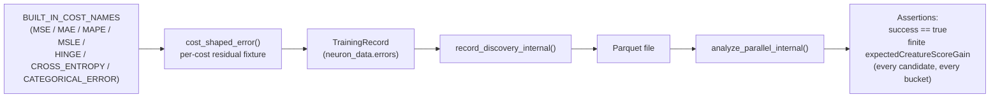

## Summary

Adds end-to-end integration tests that exercise the full
`record_discovery` → `analyze_parallel` pipeline against fixtures shaped
like each of the seven built-in NEAT-AI cost functions (`MSE`, `MAE`,
`MAPE`, `MSLE`, `HINGE`, `CROSS_ENTROPY`, `CATEGORICAL_ERROR`). Discovery
is **cost-agnostic by construction** — it never reads the cost name —
but until now there was no regression coverage proving the pipeline
survives every cost's residual distribution end-to-end. This PR delivers
that coverage so a regression in cost-agnostic behaviour fails CI rather
than surfacing as silent production drift. Closes #1246.

## Evidence

The change is backend Rust integration tests only — no UI, no
performance work. Verification comes from the new tests passing.

```text
$ cargo test --test cost_compatibility -- --test-threads=2
running 9 tests
test end_to_end::cost_compatibility_categorical_error ... ok
test end_to_end::cost_compatibility_categorical_error_quantised_zero_variance ... ok
test end_to_end::cost_compatibility_cross_entropy ... ok
test end_to_end::cost_compatibility_hinge ... ok
test end_to_end::cost_compatibility_mae ... ok
test end_to_end::cost_compatibility_mape ... ok
test end_to_end::cost_compatibility_mse ... ok
test end_to_end::every_built_in_cost_has_a_dedicated_test ... ok
test end_to_end::cost_compatibility_msle ... ok

test result: ok. 9 passed; 0 failed; 0 ignored; 0 measured; 0 filtered out;
finished in 4.00s
```

All nine tests complete in **4 seconds** total — well inside the
10-second-per-test budget (Issue #603).

### Pipeline exercised



## Test Plan

New test file `tests/cost_compatibility/end_to_end.rs` (with
`tests/cost_compatibility/main.rs` wiring it up). Tests added:

- `cost_compatibility_mse`
- `cost_compatibility_mae`
- `cost_compatibility_mape`
- `cost_compatibility_msle`
- `cost_compatibility_hinge`
- `cost_compatibility_cross_entropy`
- `cost_compatibility_categorical_error`
- `cost_compatibility_categorical_error_quantised_zero_variance`
  — covers acceptance criterion #6 (variance-based detectors must not
  divide by zero on quantised `{0, 1}` output errors).
- `every_built_in_cost_has_a_dedicated_test` — meta-guard that fails if a
  new cost is added to `BUILT_IN_COST_NAMES` without a matching test.

Shared helpers added to `tests/common/mod.rs`:

- `BUILT_IN_COST_NAMES` — canonical list of NEAT-AI's seven costs.
- `cost_shaped_error(cost, obs_index, output_index)` — deterministic
  per-cost residual generator.
- `toy_cost_creature()` — small 2-input, 3-hidden, 2-output creature
  shared across the cost-compatibility tests.

Quality gate: `./quality.sh < /dev/null` passes (fmt, clippy with
`-D warnings`, check, full test suite, doc build, release build).
