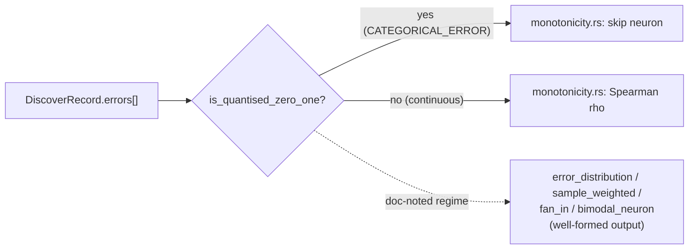

## Summary

Hardened the distribution-sensitive discovery modules flagged by the
#1245 audit against `CATEGORICAL_ERROR`'s quantised `{0, 1}` output
errors so the pipeline produces well-formed candidates instead of
NaN-bearing or mass-flagged ones. Closes #1247.

### What changed

- **New** `src/analysis/quantised_error.rs` — runtime predicate
  `is_quantised_zero_one(errors: &[f32]) -> bool` that detects the
  Bernoulli-style regime (every finite entry ≈ `0` or `1`, with at
  least 5 % mass at each mode). Used by detectors that must skip the
  regime.
- **Guarded** `src/analysis/detection/monotonicity.rs` — neurons whose
  recorded errors are quantised `{0, 1}` are skipped, because Spearman
  rank correlation on two tied groups would otherwise mass-flag every
  CATEGORICAL_ERROR-driven hidden neuron as non-monotonic.
- **Documented degraded-but-well-formed behaviour** in
  `error_distribution.rs`, `sample_weighted.rs`, `fan_in.rs`, and
  `bimodal_neuron.rs`. The existing `is_finite` / `variance > eps`
  guards already prevent NaN and division-by-zero — the doc comments
  capture *what* the modules report on Bernoulli input so callers know
  not to mis-interpret the numbers.
- **`docs/COST_FUNCTION_NOTES.md`** updated to record the #1247
  resolution under §6.

### Why guard monotonicity but not the others?

`monotonicity.rs` consumes the error series ordinally — ranks collapse
under `{0, 1}` and the detector emits false positives. The other four
modules consume errors as magnitudes, weights, or moment-based
statistics that remain well-formed under Bernoulli input (the variance
is `p(1−p)`, the skewness has a closed form, etc.). Skipping them
would lose useful ranking signal; documenting the degraded
interpretation preserves it.

## Evidence

This is a backend-only change with no UI to screenshot.

- All new tests pass: 7 detection + 7 recommendation + 5 scoring +
  13 unit tests inside `analysis::quantised_error`.
- Existing `tests/cost_compatibility/end_to_end.rs` already covers the
  full `record_discovery → analyze_parallel` pipeline for
  `CATEGORICAL_ERROR` (including a dedicated quantised `{0, 1}`
  variance test from #1246 acceptance criterion #6), and the existing
  `tests/detection/issue_643_activation_error_monotonicity.rs` suite
  still passes — the new guard does not regress continuous-error
  detection.
- `./quality.sh < /dev/null` passes.

## Test Plan

- `tests/detection/issue_1247_categorical_error_hardening.rs`
  - `monotonicity_skips_quantised_zero_one_regime`
  - `monotonicity_handles_zero_variance_error_batch_without_nan`
  - `monotonicity_still_flags_continuous_non_monotonic_neuron`
    (regression guard for the new guard)
  - `bimodal_neuron_handles_quantised_pre_activation_without_nan`
  - `bimodal_neuron_handles_constant_value_without_nan`
  - `quantised_helper_recognises_balanced_categorical_error_batch`
  - `quantised_helper_rejects_continuous_residuals`
- `tests/recommendation/issue_1247_categorical_error_hardening.rs`
  - `sample_weights_finite_for_quantised_errors`
  - `sample_weights_uniform_for_all_zero_errors`
  - `stratify_handles_quantised_errors_without_nan`
  - `stratify_handles_all_zero_error_batch`
  - `fan_in_handles_quantised_errors_without_nan`
  - `fan_in_handles_all_zero_output_errors`
  - `detect_high_error_neurons_finite_under_quantised_regime`
- `tests/scoring/issue_1247_categorical_error_hardening.rs`
  - `distribution_stats_finite_for_quantised_zero_one_batch`
  - `distribution_stats_safe_for_zero_variance_batch`
  - `is_likely_bimodal_does_not_panic_on_quantised_batch`
  - `detect_error_modes_finite_for_quantised_batch`
  - `outlier_counting_safe_on_constant_batch`
- `src/analysis/quantised_error.rs` — 13 inline unit tests covering
  detector boundary conditions (empty, all-zero, all-one, balanced,
  unbalanced, single-outlier, continuous, signed-residual,
  non-finite-mixed, round-off-tolerance, custom-fraction).
- `./quality.sh < /dev/null` — full quality gate green.
