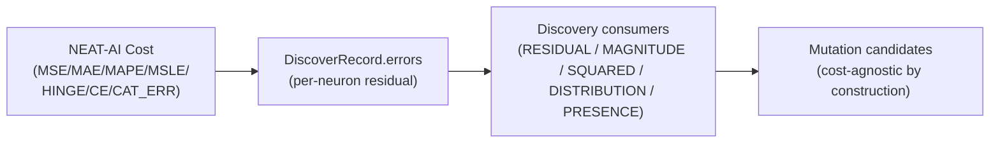

## Summary

Updated the public-facing discovery documentation to reflect which NEAT-AI
cost functions discovery supports and to make the cost-agnostic contract
explicit. The discovery pipeline already consumes per-neuron residuals
rather than the configured cost — this PR documents that contract so callers
know what they are getting. Closes #1248.

The four `docs/discoveries/*.md` files that previously claimed
"reduction in MSE" were already reworded by #1251 (the audit-delivery
follow-up); this PR completes the documentation pass by:

- Adding a "Supported cost functions" section to `README.md` listing all
  seven NEAT-AI built-in costs and noting that discovery is cost-agnostic by
  construction.
- Documenting the cost-agnostic error contract in `docs/FFI_API.md` with the
  five invariants from `COST_FUNCTION_NOTES.md §2` and a brief per-cost
  caveat callout.
- Adding a "Cost-Function Compatibility" subsection to the
  `docs/DISCOVERY_TYPES.md` overview, linking to `COST_FUNCTION_NOTES.md`.
- Adding a `docs/COST_FUNCTION_NOTES.md` entry to the README's
  *Additional Documentation* index.

## Evidence

Docs-only change — no code paths affected.



`markdownlint-cli2` run on the touched files reports `0 error(s)` across all
59 monitored markdown files.

Files updated:

- `README.md` — new `🎚️ Supported Cost Functions` section plus
  `COST_FUNCTION_NOTES.md` entry in the *Additional Documentation* table.
- `docs/FFI_API.md` — new `🎚️ Cost-Agnostic Error Contract` subsection under
  *Critical Requirements*, listing the five invariants and per-cost caveats,
  with a link to `COST_FUNCTION_NOTES.md`.
- `docs/DISCOVERY_TYPES.md` — new `🎚️ Cost-Function Compatibility` subsection
  under *Overview*, with the supported cost list and a link to
  `COST_FUNCTION_NOTES.md`.

Cross-referenced against `docs/COST_FUNCTION_NOTES.md` §2 (cost-agnostic
invariants), §4 (per-cost behaviour summary), and §6 (concrete bugs surfaced
by the audit, including Issue #1247 and Issue #1250 cited in the new callouts).

## Test Plan

- [x] `markdownlint-cli2 < /dev/null` — 0 errors across all 59 monitored
      `.md` files.
- [x] Spot-checked the updated files for Mermaid block integrity: no fenced
      ` ```mermaid ` blocks were modified.
- [x] Australian English spelling verified across the added prose (no
      `analyze` / `color` / `behavior` / `favor` / `minimize` / `maximize` /
      `optimize` / `organiz` / `defens` matches in the diff).
- [x] Verified the existing rewordings from #1251 in `add-neuron.md`,
      `add-synapse.md`, `redundant-path.md`, and `output-bias-drift.md`
      remain consistent with the new top-level wording.
