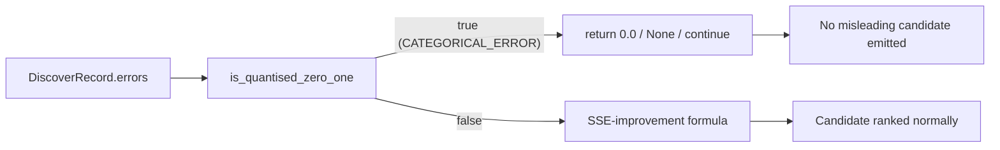

## Summary

Gate the four SSE-based "expected improvement" code paths off at runtime
when the target's recorded errors are in the quantised `{0, 1}` regime
(`CATEGORICAL_ERROR`), using the existing
`analysis::quantised_error::is_quantised_zero_one` helper that
Issue #1247 introduced. Under `CATEGORICAL_ERROR` the identity
`Σ e² = Σ e = error_count`, so `improvement = 1 − residual_sse/original_sse`
no longer corresponds to NEAT-AI's loss reduction — emitting it would
mislead the candidate ranker. Closes #1249.

Three sites are gated (path off):

- `recommendation/fan_in.rs` — `compute_least_squares_improvement` and
  `compute_two_input_regression` both return early under the regime, so
  the per-target `best_individual <= 0.0` guard drops every fan-in pair.
- `recommendation/batch_successful/detection.rs` — `evaluate_individual`
  returns `None` for quantised target errors.
- `detection/compound_degradation.rs` — `detect_weight_corrections`
  `continue`s over any synapse whose target neuron has quantised errors.

The fourth site (`synapse/post_processing.rs::compute_neuron_error_sq_map`)
is left in place with an updated doc comment: under the regime it
collapses to "fraction of network misclassifications attributable to
this neuron", which is still a sensible cost-agnostic impact-scaling
factor — gating it off would zero every neuron's impact and silence the
discovery pipeline.

`docs/COST_FUNCTION_NOTES.md` §3 tables and §6.1 follow-up entry are
updated to reflect the new ⚠️-gated semantics.

## Evidence

Backend-only change with no UI surface. Verified via TDD:

- Confirmed each new test fails against the pre-fix code (verified by
  `git stash`-ing the source change and re-running — the
  compound-degradation test reported "got 1 candidate(s)" pre-fix,
  "passed" post-fix; fan-in and batch-successful similarly reported
  pre-fix candidates that disappear post-fix).
- `./quality.sh` passes end-to-end (fmt, clippy
  `-D warnings`, doc-build with `RUSTDOCFLAGS=-D warnings`, full test
  suite with `--test-threads=2`, release build).
- Anchor tests assert the continuous-error baseline still emits
  candidates, so the gated tests cannot pass vacuously.

## Test Plan

- `tests/recommendation/issue_1249_categorical_error_sse_gating.rs`
  - `fan_in_emits_candidates_for_continuous_errors` — baseline anchor:
    continuous correlated errors produce ≥1 fan-in candidate.
  - `fan_in_emits_no_candidates_for_quantised_errors` — quantised
    `{0, 1}` target errors with strongly flag-correlated inputs emit
    zero fan-in candidates after the gate.
  - `batch_successful_emits_candidates_for_continuous_errors` —
    baseline anchor.
  - `batch_successful_emits_no_candidates_for_quantised_errors` —
    quantised target errors emit zero individually-successful
    candidates.
- `tests/detection/issue_1249_categorical_error_sse_gating.rs`
  - `compound_degradation_emits_for_continuous_errors` — baseline
    anchor on the input → hidden → output topology with bias drift.
  - `compound_degradation_skips_quantised_target_errors` — verifies
    no compound candidate's `weight_to_uuid` is the quantised neuron.
