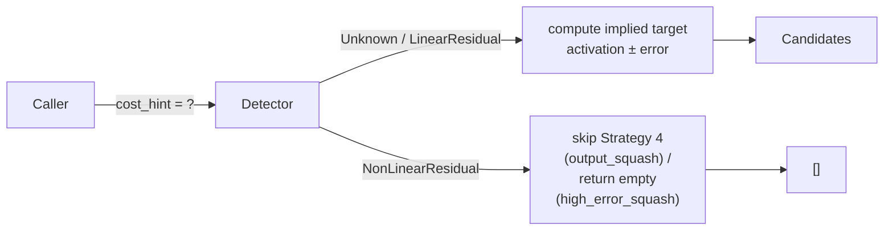

## Summary

Two detectors reconstructed an "implied target" as `activation ± error`, an identity that only holds when the recorded error is a linear residual (`MSE`/`MAE`/`CE`). For `MAPE`, `MSLE`, `HINGE`, and `CATEGORICAL_ERROR` the reconstructed target is wrong and the downstream recommendations are wrong.

This PR introduces a `CostFunctionHint` enum and a `_with_cost_hint` overload on each affected detector. When the caller declares a non-linear-residual cost, the affected code path is gated off; the historical (unhinted) entry points remain backwards-compatible. Closes #1250.

## Evidence

Bug fix / CLI change — no UI to screenshot. Verified by the new test file `tests/detection/issue_1250_implied_target_cost_hint.rs` and the new unit tests in `src/analysis/cost_function_hint.rs`. All 7 acceptance tests pass; the existing 17 tests in `issue_545_output_squash_mismatch.rs` and the 3 in `high_error_squash_exploration::tests` still pass unchanged. `./quality.sh` passes cleanly.

## Test Plan

- `src/analysis/cost_function_hint.rs` — 7 unit tests for the new `CostFunctionHint::from_name`, `allows_linear_target_reconstruction`, `is_non_linear_residual`, and default behaviour.
- `tests/detection/issue_1250_implied_target_cost_hint.rs` — 7 integration tests:
  - `implied_target_recovers_recorded_target_for_mse` — proves the identity holds for `MSE`.
  - `implied_target_diverges_for_mape_residual` — proves it diverges under `MAPE`.
  - `high_error_squash_detector_is_gated_off_for_non_linear_cost` — gating works for `MAPE`/`MSLE`/`HINGE`/`CATEGORICAL_ERROR`.
  - `high_error_squash_detector_keeps_running_for_linear_cost` — `MSE`/`MAE`/`CROSS_ENTROPY` still trigger detection.
  - `output_squash_mismatch_strategy_4_is_gated_off_for_non_linear_cost` — Strategy 4 specifically is dropped without affecting Strategies 1–3.
  - `unknown_hint_matches_legacy_*_results` × 2 — backwards-compatibility: `Unknown` hint reproduces the legacy entry-point output for both detectors.
- `docs/COST_FUNCTION_NOTES.md` §4.3, §4.4, §4.5, §4.7 and §6 updated to note that #1250 is resolved by the cost-hint plumbing.
