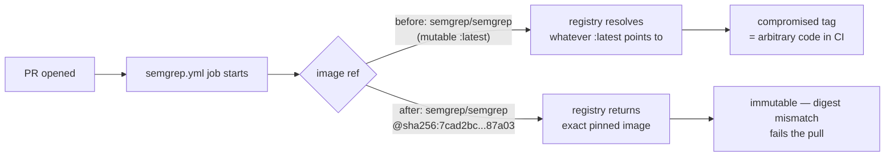

## Summary

Pinned the Semgrep job's container image in `.github/workflows/semgrep.yml`
to an immutable `@sha256:` digest, closing a supply-chain gap that the
rest of the workflow set already covered. Closes #1258.

Previously the job ran inside `semgrep/semgrep` (an unpinned mutable tag
resolving to `:latest`). Renovate's `github-actions` manager does not
track `jobs.<job>.container.image`, so the 24h `minimumReleaseAge`
quarantine in `renovate.json` did not protect this surface. A
compromised `semgrep/semgrep:latest` push would have executed inside
this repo's PR CI with access to `SEMGREP_APP_TOKEN` on the next PR
run.

The image is now pinned to the multi-arch manifest digest of
`semgrep/semgrep 1.163.0`:
`sha256:7cad2bc2d1e44f87f0bf4be6d1fa23aa90fb72015bebc89fb91385d813987a03`.
`bump-deps.sh` can rotate this digest under the same 24h window already
applied to `github-actions` packages.

## Evidence

This is a CI-only workflow change with no runtime or UI surface. Verification
is via a new Rust integration test that fails on any unpinned container image
across `.github/workflows/`:

- `tests/issue_1258_container_image_digest_pins.rs` —
  `all_workflow_container_images_are_pinned_to_sha256_digest` reads every
  workflow YAML and asserts each `image:` under a `container:` block ends
  in `@sha256:<64-hex>`.
- Confirmed the test **fails** against the unpinned baseline (reporting
  `.github/workflows/semgrep.yml:14: container image semgrep/semgrep is not
  pinned`) and **passes** after the digest pin was applied.
- Full `./quality.sh` run passes locally (fmt, clippy `-D warnings`,
  cargo check, full test suite at `--test-threads=2`, docs build, release
  build).

## Test Plan

- Added `tests/issue_1258_container_image_digest_pins.rs` with:
  - `all_workflow_container_images_are_pinned_to_sha256_digest` —
    integration test over every workflow YAML, including
    `semgrep.yml`.
  - `has_sha256_digest_accepts_full_64_hex_suffix`,
    `has_sha256_digest_rejects_tag_only`,
    `has_sha256_digest_rejects_truncated_digest` — unit tests for the
    digest validator.
  - `find_container_images_picks_up_block_form`,
    `find_container_images_strips_trailing_comment` — unit tests for
    the YAML parser helper.
- Ran the new test in isolation:
  `cargo test --test issue_1258_container_image_digest_pins -- --test-threads=1`
  → 6 passed.
- Ran the existing `tests/issue_1216_workflow_sha_pins.rs` to confirm no
  regression in adjacent action-pin enforcement.
- Ran `./quality.sh` end-to-end; all checks pass.
