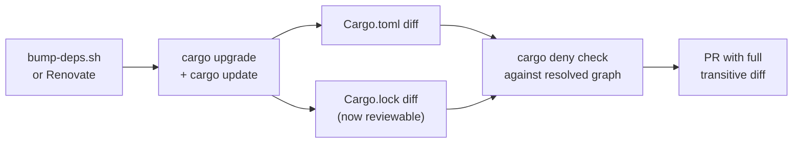

# PR Summary — Issue #1266

## Summary

Committed `Cargo.lock` to version control and removed the `Cargo.lock`
entry from `.gitignore` so the `cdylib` artefact consumed by NEAT-AI
via FFI builds reproducibly. The historical "library = no lockfile"
advice was reversed by the Cargo team in 2023; for this crate it
matters extra because `cargo-deny` / `cargo-audit` operate on the
resolved graph in `Cargo.lock` and `bump-deps.sh` PRs need a reviewable
lockfile diff during the `VIBE_BUMP_QUARANTINE_HOURS` quarantine window.

Closes #1266.

## Evidence

This is a build-system / supply-chain hardening change — no UI to
screenshot and no runtime performance impact to benchmark. Behaviour is
verified by the new tests in
`tests/issue_1266_cargo_lock_committed.rs`:

* `cargo_lock_exists_at_repo_root` — asserts a `Cargo.lock` exists at
  the manifest root, so a clone of any commit can be built with the
  same resolved dependency graph.
* `gitignore_does_not_ignore_cargo_lock` — parses `.gitignore` and
  asserts no active rule (`Cargo.lock`, `/Cargo.lock`, or
  `**/Cargo.lock`) ignores the lockfile. Comments and negation rules
  are skipped.

Before-and-after flow for a dependency-bump PR with the lockfile
committed:

Quality gate: `./quality.sh` passes cleanly (fmt, clippy, cargo deny,
cargo test, doc, release build).

## Test Plan

* Added `tests/issue_1266_cargo_lock_committed.rs` with two tests
  covering the lockfile presence and the `.gitignore` rule.
* Verified TDD red→green: the new
  `gitignore_does_not_ignore_cargo_lock` test failed against the
  pre-fix `.gitignore` (line 20: `Cargo.lock`) and passed after the
  rule was removed.
* Full `./quality.sh` run: all suites green, including the new tests.

## Files changed

* `.gitignore` — removed the `Cargo.lock` ignore rule; replaced it with
  a comment explaining why the lockfile is committed.
* `Cargo.lock` — committed for the first time (2913 lines, currently
  resolved transitive graph).
* `tests/issue_1266_cargo_lock_committed.rs` — new regression test.
* `docs/archive/pr-summaries/pr-summary-1266.md` — this file.
