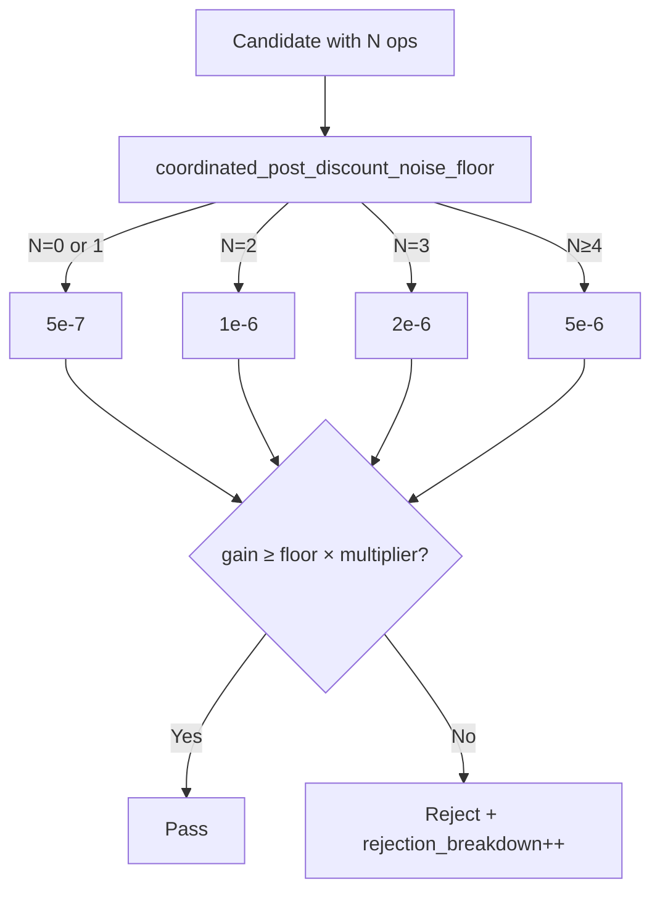

## Summary

Replaced the single `COORDINATED_POST_DISCOUNT_NOISE_FLOOR` (5e-7) with an
operation-count-aware lookup so higher-op coordinated-structural candidates
are screened against a proportionally stricter floor — matching the
per-op-count empirical-discount tiers from #1058. production discovery-cache commit
`e85c5d2` (creature `bcbca347`) captured two 4-op failures (5.06e-7,
5.21e-7) that **just cleared** the legacy floor yet harmed the network by
1000–6000× the predicted magnitude; the new 4+-op floor (5e-6) rejects
both by an order of magnitude. Closes #1272.

## Evidence

This is a backend candidate-scoring change with no UI surface. Per-tier
behaviour is verified by `tests/issue_1272_per_op_count_noise_floor.rs`,
which exercises:

- Each per-tier constant carries the expected value (1-op 5e-7, 2-op 1e-6,
  3-op 2e-6, 4+-op 5e-6).
- The dispatch-side filter applies the correct floor for each op-count
  tier in the same `retain` pass.
- The `bcbca347` 4-op entries (5.06e-7, 5.21e-7) are now rejected.
- 1-op behaviour is unchanged (5e-7 floor preserved).
- The deprecated `COORDINATED_POST_DISCOUNT_NOISE_FLOOR` alias still
  builds and maps to the 1-op value.

### Collapse-fixture compatibility

The `coordinated_structural_can_collapse_hidden_neuron_to_single_synapse`
and `issue_522::collapse_hidden_neuron_with_identity_squash` regression
fixtures produce a legitimate 4-op coordinated candidate whose
post-calibration gain (~9.95e-7) sits just below the new 4+-op floor
(5e-6). To keep the collapse contract observable under the stricter
production floors, a test-only env-var override
(`NEAT_AI_DISCOVERY_COORDINATED_NOISE_FLOOR_MULTIPLIER`, default `1.0`)
is read by `coordinated_post_discount_noise_floor` and applied
multiplicatively to the per-tier floor. A new
`CoordinatedNoiseFloorRelaxGuard` RAII guard in `tests/common/mod.rs`
sets the multiplier to `0.01` for the affected `#[serial]` tests and
restores the prior value on drop. Production callers leave the env var
unset and continue to receive the strict per-tier floors.

## Test Plan

- New: `tests/issue_1272_per_op_count_noise_floor.rs`
  - `per_tier_constants_have_expected_values`
  - `helper_returns_per_tier_values_for_each_op_count` (covers op_counts
    0, 1, 2, 3, 4, 5, 128 — the acceptance-criteria tiers plus the >=4
    saturation boundary)
  - `dispatch_filter_applies_per_tier_floor`
  - `bcbca347_4op_entries_are_filtered` (regression for the two 4-op
    entries called out in the issue evidence)
  - `one_op_floor_unchanged_at_5e_minus_7`
  - `legacy_alias_maps_to_one_op_floor`
- Existing tests updated to reference
  `COORDINATED_POST_DISCOUNT_NOISE_FLOOR_1OP` (the new 1-op constant)
  instead of the now-deprecated alias — no behavioural change since
  every existing test exercises 1-op candidates and the 1-op floor is
  preserved at 5e-7:
  - `tests/coordinated_min_gain_floor.rs`
  - `tests/issue_1139_coordinated_floor_always_applied.rs`
- `./quality.sh` (clippy `-D warnings`, `cargo test --lib --tests
  --all-features`, doc build with `RUSTDOCFLAGS="-D warnings"`, release
  build).
