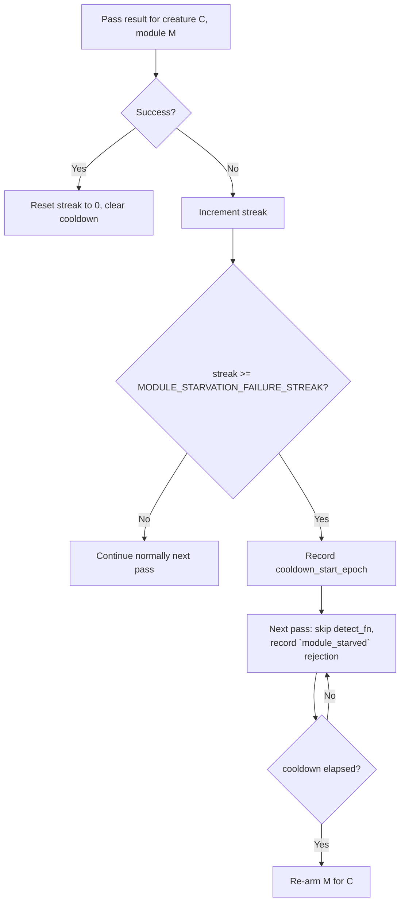

## Summary

Adds a per-creature, per-module starvation tracker that temporarily disables a
single discovery module for a single creature after `N` consecutive failures
without an intervening success. This closes the gap between the population-wide
module gate (Issue #1060), creature-level Conservative mode (Issue #1132), and
per-target cooldown (`TargetFailureTracker`, Issue #1130) — none of which can
disable a single module for one creature. Motivated by production discovery-cache commit
`e85c5d2` (creature `bcbca347`), where `coordinated-structural` recorded 41
consecutive failures and 0 successes, consuming ~91% of the candidate budget
while other modules went unexplored.

Closes #1273.

## Evidence

CLI/backend change — no UI to screenshot.

Key implementation points:

- **New module**: `src/analysis/module_starvation_tracker.rs` — owns per-module
  `consecutive_failures`, `last_failure_epoch`, `last_success_epoch`, and
  `cooldown_start_epoch`. Thread-safe via `&self` reads / `&mut self` writes.
- **New constants** in `src/analysis/constants/candidate_scoring.rs`:
  - `MODULE_STARVATION_FAILURE_STREAK = 15`
  - `MODULE_STARVATION_COOLDOWN_EPOCHS = 10`
  - Both env-var overridable (`NEAT_AI_DISCOVERY_MODULE_STARVATION_FAILURE_STREAK`,
    `NEAT_AI_DISCOVERY_MODULE_STARVATION_COOLDOWN_EPOCHS`) with documented
    valid ranges.
- **Discovery dispatch wiring** (`src/analysis/discovery_dispatch.rs`): new
  `detect_discovery_modules_parallel_with_starvation` skips a module's
  `detect_fn` while the tracker reports `is_starved(module, epoch)`. The skip
  is propagated to the merge phase via a `starved` flag on the entry, which
  records one `module_starved` rejection in the synapse metadata.
- **Drought diagnostic**: `DroughtDiagnostic.starved_module_count` (camelCase
  JSON) reports the number of modules in active cooldown for the creature.
- **New rejection reason**: `module_starved` (added to `ALL_REJECTION_REASONS`
  and `friendly_reason()` map).
- **Backwards compatibility**: existing entry points
  (`detect_discovery_modules_parallel`, `prepare_and_detect_discovery_modules`,
  `run_discovery_modules_parallel`) delegate to the starvation-aware variants
  with `None` tracker / `0` epoch, so callers that have not yet adopted the new
  signal behave exactly as before.

## Test Plan

New unit tests in `src/analysis/module_starvation_tracker.rs`:

- `record_failure_increments_consecutive_counter` — streak counting.
- `threshold_trip_disables_module` — hitting the streak threshold sets the
  cooldown_start_epoch and trips `is_starved`.
- `cooldown_expires_after_window` — module re-armed after `cooldown_epochs`.
- `success_clears_streak_and_cooldown` — a single success resets the counter
  and clears the cooldown.
- `unknown_module_is_not_starved` — never-seen modules pass through.
- `starved_module_count_only_counts_active_cooldowns` — diagnostic counter
  only reports modules currently in active cooldown.
- `regression_bcbca347_coordinated_structural_disabled_after_fifteen_failures`
  — replays the 41-failure streak from production creature `bcbca347` and
  asserts the module is disabled by the 15th failure and re-armed once the
  10-epoch cooldown elapses.
- `starved_module_names_returns_sorted_distinct_list` — diagnostic naming.
- `env_var_overrides_thresholds` — defaults reachable via `new()`.

New integration tests in `src/analysis/discovery_dispatch_parallel_tests.rs`:

- `starvation_tracker_skips_detect_fn_when_module_is_starved` — verifies the
  starved module's closure does not run during parallel detection.
- `merge_phase_records_module_starved_rejection` — verifies exactly one
  `module_starved` rejection is recorded in `synapseMetadata.rejection_breakdown`.
- `starvation_tracker_optional_when_none_passed` — confirms the legacy
  None-tracker path is unchanged.

New unit test in `src/analysis/drought_diagnostic.rs`:

- `diagnostic_reports_starved_module_count` — verifies the new
  `starvedModuleCount` field is populated when a starvation tracker is
  supplied.

Quality gate run:

- `cargo build --lib` — clean.
- `cargo check --all-targets --all-features` — clean.
- `cargo clippy --all-targets --all-features -- -D warnings` — clean.
- `cargo test --lib --tests --all-features -- --test-threads=2` — 597
  passing (5 ignored), 0 failing.
- `RUSTDOCFLAGS="-D warnings" cargo doc --no-deps` — clean.
