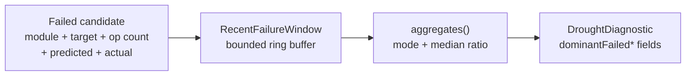

# PR Summary — Enrich drought diagnostic with dominant-failure-pattern fields

## Summary

Extended `DroughtDiagnostic` with six dominant-failure-pattern fields so a
single FFI payload now answers questions that previously required ~10 manual
GitHub API calls to diagnose: which module is failing, which target neuron
absorbs the failures, how many operations per candidate, and how far off the
gain prediction is from reality. Closes #1274.

A new sibling structure, `RecentFailureWindow`, holds a bounded rolling log
(default 50 failures) of `{module, target_uuid, operation_count, predicted_gain,
actual_gain}` and computes the dominant-pattern aggregates in `O(window_size)`.
Aggregates are reported only once the window holds at least 5 entries so
tiny samples cannot produce noisy "100 %" shares.

## Evidence

This is a backend / FFI-schema change with no UI. The aggregation behaviour is
verified by unit tests:

- `recent_failure_window::tests::empty_window_returns_no_aggregates`
- `recent_failure_window::tests::partial_window_below_minimum_returns_no_aggregates`
- `recent_failure_window::tests::full_window_emits_dominant_pattern`
- `recent_failure_window::tests::all_same_target_window_reports_full_share`
- `recent_failure_window::tests::mixed_modules_window_picks_majority`
- `recent_failure_window::tests::capacity_evicts_oldest_entry`
- `recent_failure_window::tests::predicted_vs_actual_gap_handles_zero_predicted`
- `recent_failure_window::tests::bcbca347_regression_shape` — the regression
  test required by the acceptance criteria: 91 % coordinated-structural,
  same target neuron, 4 ops, large negative ratio.
- `drought_diagnostic::tests::dominant_pattern_fields_default_to_none_without_window`
- `drought_diagnostic::tests::dominant_pattern_fields_populate_from_window_bcbca347`
- `drought_diagnostic::tests::dominant_pattern_fields_silent_below_minimum_sample`

`./quality.sh` passed (fmt, clippy `-D warnings`, doc build, full test suite,
release build).

## Test Plan

- New file `src/analysis/recent_failure_window.rs` — 8 unit tests covering
  empty / partial / full / same-target / mixed-modules windows, FIFO
  eviction, zero-predicted ratio handling, and the bcbca347 regression.
- Extended `src/analysis/drought_diagnostic.rs` — 3 additional unit tests
  asserting that the six new fields default to `None` / `0.0` without a
  window, populate correctly from a bcbca347-shaped window, and stay
  silent below the 5-failure floor.
- Updated existing `DroughtInputs`-constructing tests to include the new
  `recent_failures: None` field (no behavioural change).
- `docs/DROUGHT_PLAYBOOK.md` updated with the six new diagnostic fields,
  their interpretation, and the operator lever each one points at.
