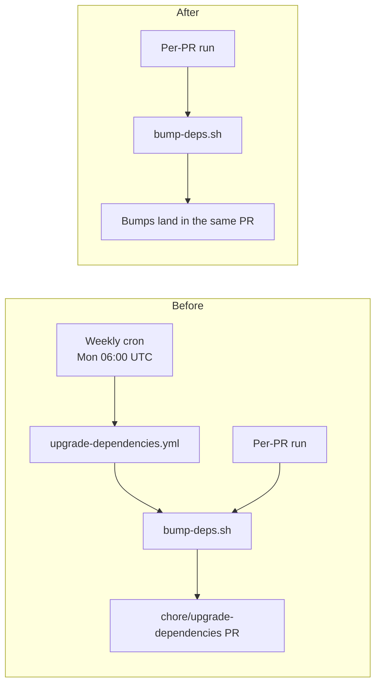

# Issue #1282 — Remove weekly Cargo dependency upgrade workflow

## Summary

Deleted `.github/workflows/upgrade-dependencies.yml` — the weekly Monday
06:00 UTC cron that ran `bump-deps.sh` and opened a
`chore/upgrade-dependencies` PR. Per-PR dependency bumping via
`bump-deps.sh` is unchanged and continues to satisfy the "default to
latest on every PR" policy. Stale references to the deleted workflow in
`bump-deps.sh` and `renovate.json` comments were updated to point at the
per-PR path. Closes #1282.

## Evidence

Backend/CI change with no UI — verified by running the targeted test
file and the full quality gate. `./quality.sh < /dev/null` passes
cleanly (`✅ All quality checks passed!`).

Regression test added: `tests/issue_1234_quarantine_enforcement.rs::scheduled_upgrade_workflow_has_been_removed`
asserts the workflow file is absent so the cron path cannot be
reintroduced silently.

## Test Plan

- Modified `tests/issue_1234_quarantine_enforcement.rs`:
  - Renamed `upgrade_workflow_invokes_bump_deps_script` to
    `scheduled_upgrade_workflow_has_been_removed`. The original test
    asserted the workflow file existed and invoked `bump-deps.sh`; the
    underlying business logic — the weekly workflow — has been removed,
    so the test now asserts the file is absent. The other two tests
    (`renovate_json_configures_minimum_release_age` and
    `bump_deps_script_enforces_quarantine`) are unchanged.
- `cargo test --test issue_1234_quarantine_enforcement` — 3 passed.
- `./quality.sh < /dev/null` — all checks pass (shellcheck, cargo deny,
  build, fmt, clippy, check, full test suite, doc build, release build).

## Files changed

- `.github/workflows/upgrade-dependencies.yml` — deleted.
- `tests/issue_1234_quarantine_enforcement.rs` — updated test contract
  to reflect the workflow removal.
- `bump-deps.sh` — updated stale comment that referenced the removed
  workflow.
- `renovate.json` — updated `description` array entry that referenced
  the removed workflow.
