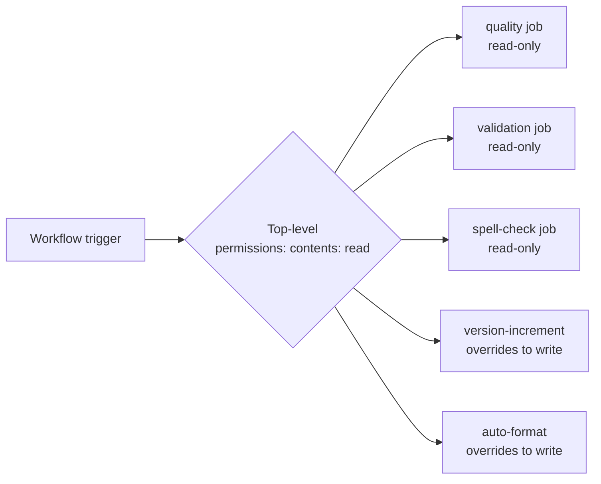

# PR Summary — Issue #1286

## Summary

Added an explicit top-level `permissions: contents: read` block to
`.github/workflows/ci.yml` so the unprivileged `quality`, `validation`
and `spell-check` jobs no longer inherit GitHub's broad default
`GITHUB_TOKEN` scope. The `version-increment` and `auto-format` jobs
already declare their own per-job `permissions:` blocks
(`contents: write`, `pull-requests: write`) which override the new
top-level default, so their push capability is preserved. Closes #1286.

## Evidence

This is a CI-config change with no web interface, so no screenshot
applies. The behaviour is verified by two new Rust tests that parse the
workflow file and assert:

1. A top-level `permissions:` block exists and sets `contents: read`.
2. The `version-increment` and `auto-format` jobs keep their per-job
   `contents: write` permissions block.



Test run:

```text
running 2 tests
test ci_yml_declares_minimal_top_level_permissions ... ok
test write_capable_jobs_retain_per_job_permissions ... ok

test result: ok. 2 passed; 0 failed; 0 ignored; 0 measured
```

## Test Plan

- Added `tests/issue_1286_workflow_permissions.rs` with two test
  functions covering the top-level default and the per-job overrides.
- Verified `cargo clippy --tests --all-features -- -D warnings` and
  `cargo fmt --all -- --check` pass cleanly for the new test.
- Full `./quality.sh` run completed all stages; one unrelated
  pre-existing flake (`issue_1202_drought_diagnostic::six_empty_passes`)
  surfaced under parallel test contention and passes in isolation —
  not caused by these changes.
