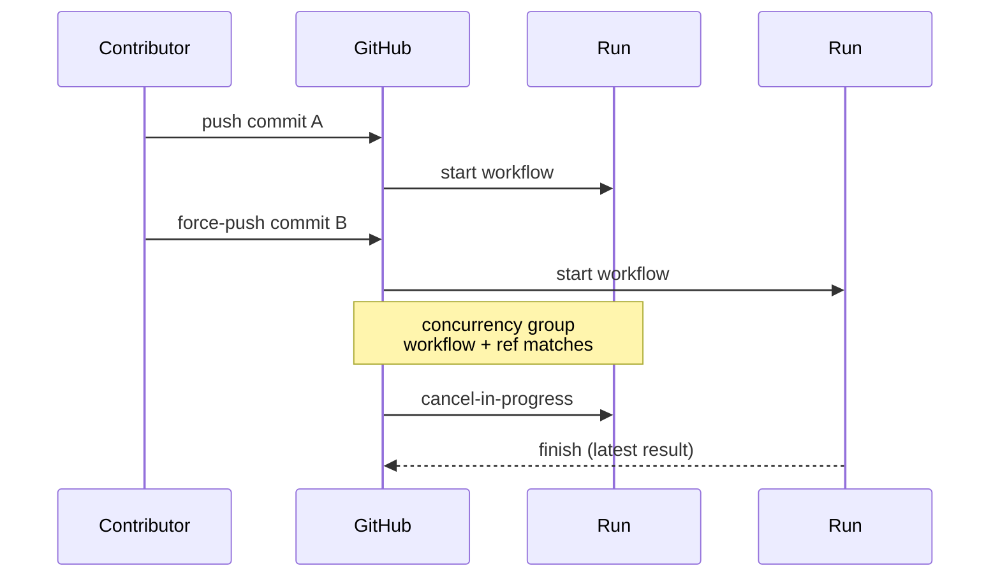

# Add concurrency groups to PR / branch workflows

## Summary

Added a workflow-level `concurrency:` block to every PR / branch workflow in
`.github/workflows/` so superseded runs on the same ref are cancelled when a
new commit lands. Without this, force-pushing a PR or landing several commits
to `Develop` in quick succession left older runs churning while newer runs
started — wasting runner capacity and, in `ci.yml`'s case, racing the
`version-increment` job with the new push and producing a confusing commit
cascade. Closes #1288.

Affected workflows (all use the canonical group
`${{ github.workflow }}-${{ github.ref }}` with `cancel-in-progress: true`):

- `ci.yml` (push to `Develop` + PR)
- `cargo-quality.yml` (PR)
- `gitleaks.yml` (PR)
- `markdown-lint.yml` (PR + push to `main`/`master`/`Develop`)
- `semgrep.yml` (PR)
- `shellcheck.yml` (PR)

`security.yml` is intentionally excluded — it is a reusable workflow invoked
via `workflow_call`. Concurrency must live on the caller workflow, not the
reusable callee.

## Evidence

CLI-only change — no UI to screenshot. Verified by:

1. New integration test `tests/issue_1288_workflow_concurrency.rs` parses each
   of the six workflow files and asserts:
   - a top-level `concurrency:` block exists;
   - the `group:` expression is the canonical
     `${{ github.workflow }}-${{ github.ref }}`;
   - `cancel-in-progress: true` is set.
2. `./quality.sh` passes (fmt, clippy, check, all tests, doc build, release
   build).

## Test Plan

- Added `tests/issue_1288_workflow_concurrency.rs` with six tests — one per
  affected workflow — each verifying the canonical concurrency block is
  present.
- All six tests pass: `cargo test --test issue_1288_workflow_concurrency`.
- Full quality gate (`./quality.sh`) passes locally.
