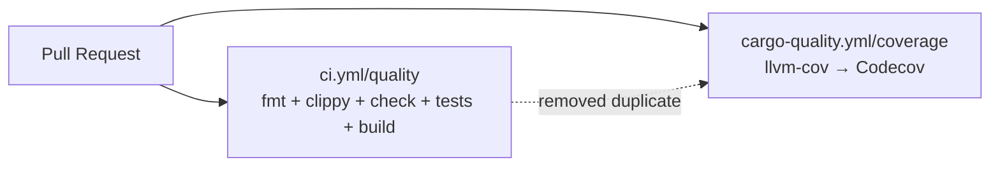

## Summary

Trimmed `.github/workflows/cargo-quality.yml` to the coverage path only.
`cargo fmt --check` and `cargo clippy` were running twice on every pull
request — once in `ci.yml/quality` (with `RUSTFLAGS: "-D warnings"` and
the full feature set) and again in `cargo-quality.yml/quality`. Both
jobs build the project from scratch, so the duplication doubled CI
runtime for two checks that always produce the same result. The
fmt/clippy gate stays in `ci.yml/quality`; the trimmed workflow now
exists solely to generate `lcov.info` and upload it to Codecov (the
unique signal that was worth keeping). Closes #1289.

## Evidence

This is a CI/workflow change with no runtime behaviour, so there is
nothing to screenshot. Evidence is in the tests:

- `bash tests/test_cargo_quality_workflow.sh` — passes (8/8). Asserts
  the coverage steps remain and that `cargo fmt --check` /
  `cargo clippy` are no longer invoked (comment lines are skipped so
  the header explaining the removal does not trigger a false positive).
- `cargo test --test issue_1287_workflow_timeouts` — passes (7/7).
  Updated to look for the renamed `coverage` job in
  `cargo-quality.yml` and confirm it still declares
  `timeout-minutes:` (Issue #1287 invariant).
- `./quality.sh` — passes cleanly.

## Test Plan

- [x] Updated `tests/test_cargo_quality_workflow.sh` to match the
      new coverage-only contract: asserts checkout, rust-toolchain,
      cargo-llvm-cov, codecov-action, `contents: read`, and the
      pull_request trigger remain; asserts the duplicate
      `cargo fmt --check` and `cargo clippy` invocations were removed
      (comment-only lines stripped before the absence check so the
      explanatory header does not trip it).
- [x] Updated `tests/issue_1287_workflow_timeouts.rs` —
      `cargo_quality_yml_job_declares_timeout_minutes` now looks up
      the job by its new name (`coverage`) and still asserts the
      Issue #1287 timeout invariant.
- [x] Ran `./quality.sh` — passes cleanly.

### Test modifications (per TDD policy)

Two existing tests were tightened, not removed:

- `tests/test_cargo_quality_workflow.sh` originally asserted the
  presence of `cargo fmt --check` and `cargo clippy` because that was
  the workflow's contract under Issue #1180. The contract changed in
  this PR: those steps are now explicitly *not* part of this workflow.
  The test was updated to assert their absence (the duplicate gates
  live in `ci.yml/quality`), and a comment-stripping helper was added
  so the workflow's explanatory header comment does not trigger a
  false positive.
- `tests/issue_1287_workflow_timeouts.rs` referenced the old job name
  (`quality`); the renamed job (`coverage`) is now the lookup target.
  The timeout invariant being tested is unchanged.
