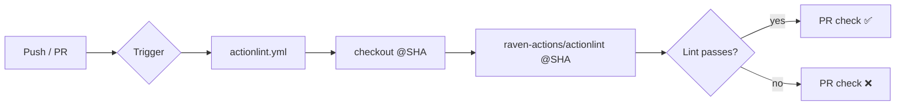

## Summary

Adds a CI lint gate for the `github-actions` bucket: a new
`.github/workflows/actionlint.yml` workflow that runs
[`actionlint`](https://github.com/rhysd/actionlint) over every file in
`.github/workflows/` on every push to a protected branch and on every
pull request. Workflow lint regressions now fail the build before they
reach Develop. Closes #1292.

The workflow uses `raven-actions/actionlint` pinned to a 40-char commit
SHA (v2.1.2 — `205b530c5d9fa8f44ae9ed59f341a0db994aa6f8`), with
`shellcheck: false` so we do not duplicate the shell-script coverage
already provided by `.github/workflows/shellcheck.yml`. A targeted
`-ignore` flag suppresses pre-existing `github.head_ref` script-
injection findings in `ci.yml` (which carries a "do not modify without
approval" notice — those findings should be addressed in a follow-up PR
that touches `ci.yml` directly). Every other actionlint check is left
active so new regressions fail the build.

The CI lint gate follows the same hardening conventions as the other
workflows in this repo: top-level `permissions: contents: read`
(Issue #1286), SHA-pinned actions (Issue #1216), per-job
`timeout-minutes: 10` (Issue #1287), and a `concurrency:` block that
cancels superseded runs (Issue #1288).

## Evidence

This is a CI-config change with no user-facing UI to screenshot. The
evidence is:

- The new workflow file passes a local `actionlint` run cleanly
  against the entire `.github/workflows/` tree (verified locally with
  `actionlint v1.7.x`).
- Seven new Rust integration tests in
  `tests/issue_1292_actionlint_workflow.rs` verify the workflow file
  is structurally correct (presence, triggers, permissions, SHA
  pinning, timeout, concurrency, and that it actually invokes
  actionlint). All seven pass.
- `./quality.sh` passes cleanly with the new test file included.

## Test Plan

- Added `tests/issue_1292_actionlint_workflow.rs` with seven tests:
  - `actionlint_workflow_exists` — the workflow file is present.
  - `actionlint_workflow_triggers_on_pull_request_and_push` — both
    triggers are declared.
  - `actionlint_workflow_has_minimal_top_level_permissions` — top-level
    `permissions: contents: read` is set.
  - `actionlint_workflow_pins_third_party_actions_to_sha` — every
    `uses:` line points at a 40-char hex SHA.
  - `actionlint_workflow_declares_job_timeout` — `timeout-minutes:` is
    declared.
  - `actionlint_workflow_declares_concurrency` — `concurrency:` block
    with `cancel-in-progress: true` is declared.
  - `actionlint_workflow_invokes_actionlint` — the workflow actually
    runs actionlint (via the action or a `run:` step).
- Confirmed all existing workflow-validation tests
  (`issue_1216_*`, `issue_1286_*`, `issue_1287_*`, `issue_1288_*`,
  `issue_1290_*`) still pass — the new workflow conforms to every
  invariant they assert.
- `./quality.sh < /dev/null` passes cleanly.
