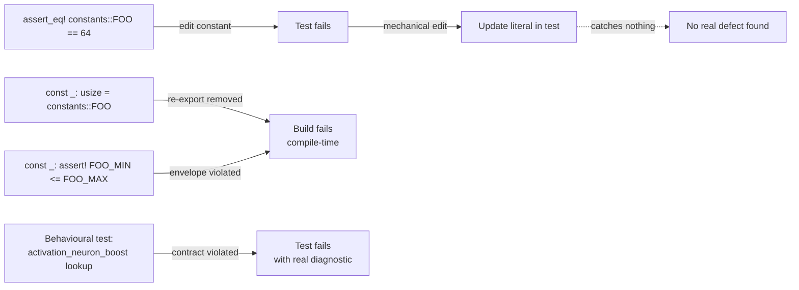

## Summary

Rewrites two test files that consisted almost entirely of circular
magic-value `assert_eq!(constants::FOO, <literal>)` assertions — the
canonical anti-pattern flagged by the test audit. Each assertion passed
if and only if the literal in the test matched the literal in
`src/analysis/constants/*.rs`, obstructed legitimate retuning of every
discovery constant, and caught no real defect.

The new files split the original intent into two stronger guarantees:

- **Compile-time re-export and invariant checks** — `const _: T =
  constants::FOO;` confirms each constant is still reachable via the
  central module (a stronger guarantee than the runtime assertion, since
  any missing re-export breaks the build). `const _: () = assert!(...)`
  declarations encode pure-constant invariants (logistic curve
  positivity, hold-out fraction inside `(0, 1)`, monotonic op-count
  discounts, compression bounds, pessimism floors inside `[0, 1]`,
  etc.). These execute at compile time, cost zero runtime, and never
  need updating when a value is tuned within its declared envelope.
- **Behavioural tests** — runtime tests for helper functions
  (`activation_neuron_boost`, `cmp_f32_*`, `coordinated_empirical_discount`)
  and for the consolidated-constants behaviour exercised through real
  detection modules (saturation, dead-neuron). These survive value
  tuning because they assert on observable behaviour, not on magic
  numbers.

Closes #1295.

## Evidence

CLI-only refactor of two test files — no UI surface to screenshot. The
behavioural change is captured by the test outcomes themselves:

```
test result: ok. 14 passed; 0 failed; 0 ignored
```

`./quality.sh` passes end-to-end (fmt, clippy `-D warnings`, check,
full test suite of 171 analysis integration tests, doc build, release
build).

### Before / after at a glance



## Test Plan

Modified test files:
- `tests/analysis/issue_938_constants_submodule_organisation.rs`
- `tests/analysis/issue_424_consolidate_discovery_constants.rs`

Coverage retained / strengthened:
- Every constant previously asserted via `assert_eq!` is still
  reachable through a `const _:` re-export check — removing any
  re-export breaks the build.
- Pure-constant invariants (logistic curve positivity, hold-out
  fraction in `(0, 1)`, sample-threshold consistency, monotonic
  coordinated discounts, compression bounds, pessimism floor / curve
  envelopes, sentinel tolerance vs gap) are now compile-time
  `const _: () = assert!(...)` declarations.
- Behavioural tests retained: `activation_neuron_boost` contract,
  NaN-safe comparator ordering, `coordinated_empirical_discount`
  monotonicity / saturation, `CANDIDATE_SENTINELS` low/zero/high
  coverage and pairwise separation, saturation / dead-neuron detection
  through the consolidated constants.

Verification:
- `cargo test --test analysis` → 14 of the new constants-tests pass,
  full suite 171/171.
- `./quality.sh` → all gates green (fmt, clippy `-D warnings`,
  cargo check, doc build, release build).
