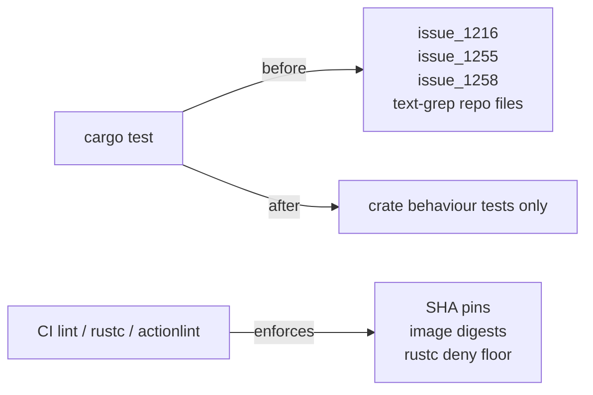

## Summary

Deleted three Rust integration tests that were repo-config linters dressed up
as `cargo test` cases. Each opened a workflow YAML or `Cargo.toml`, ran a
text-shape regex/line scan, and asserted on the source text — never invoking
any library function and never exercising crate behaviour. They slowed
`cargo test`, broke on cosmetic reformats, and produced no behavioural signal.

Files removed:

- `tests/issue_1216_workflow_sha_pins.rs` — text-grepped every workflow file
  for 40-character commit SHAs on `uses:` lines. The same policy is enforced
  on every PR by `.github/workflows/actionlint.yml`, and the recurring
  `bump-deps`/Renovate workflow keeps the pins fresh.
- `tests/issue_1258_container_image_digest_pins.rs` — text-grepped workflow
  files for `@sha256:<64-hex>` digests on `container.image` values. Same
  policy concern (supply-chain pinning), same wrong runner — belongs in a
  CI lint or Renovate config, not the crate test suite.
- `tests/issue_1255_rustc_lints.rs` — read `Cargo.toml` as plaintext, ran a
  hand-rolled section/field parser, and asserted that
  `[lints.rust].unsafe_op_in_unsafe_fn = "deny"`. Redundant — rustc itself
  reads `[lints.rust]` from `Cargo.toml` and enforces the deny floor on
  every `cargo check` / `cargo build` (steps 6–8 of `quality.sh`). The
  enforcement remains; only the source-text assertion is gone.

Closes #1296.

## Evidence

This is a test-cleanup change with no library behaviour change and no UI.
Verification is via the quality gate:

- `./quality.sh` runs fmt, clippy (`-D warnings`), `cargo check`, the full
  `cargo test --lib --tests --all-features`, rustdoc, and a release build.
  All steps pass after the removals.
- The lint enforcement that the deleted tests pretended to verify is still
  in place:
  - `Cargo.toml` `[lints.rust]` block (lines 194–195) — rustc enforces
    `unsafe_op_in_unsafe_fn = "deny"` natively.
  - `.github/workflows/actionlint.yml` — actionlint runs on every PR and
    every push to `main` / `master` / `Develop`.

## Test Plan

- `./quality.sh` — passes (fmt, clippy, check, test, doc, release build).
- No tests were modified; three were removed because they tested repo
  policy, not crate behaviour. The Issue body itself recommends "Delete"
  as an acceptable outcome where CI already covers the same rule.
- No new tests added — the deletions remove redundancy; the surviving
  test suite continues to exercise the crate's public API.
