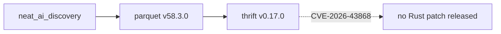

## Summary

Dismissed Dependabot alert #1 (GHSA-2f9f-gq7v-9h6m / CVE-2026-43868 — Apache Thrift memory-allocation excessive size) as `tolerable_risk` and documented the decision in `deny.toml`. **No Rust fix is available** — the GitHub advisory lists `first_patched_version: null` for the Rust ecosystem, and the upstream `thrift` crate is at its latest published version (0.17.0). The Apache project's fix landed in Thrift 0.23.0, but that release covers the C++/Java/Python implementations only and has not been ported to the Rust crate. Closes #1297.

## Evidence

This is a configuration-only change with no behavioural impact. Evidence is the upstream state of the ecosystem and the dismissed alert.

**Dependency chain** (confirmed via `cargo tree -i thrift`):

**Risk assessment**:
- **Severity**: Medium (CVSS 5.3, vector `AV:N/AC:L/PR:N/UI:N/S:U/C:N/I:N/A:L`) — availability impact only, no confidentiality or integrity impact.
- **CWE**: CWE-789 (memory allocation with excessive size value).
- **Exposure**: `thrift` is a transitive dependency via `parquet` and is used only to parse Parquet file metadata. We never decode untrusted Thrift over the network. Risk is bounded by the Parquet files the application chooses to read.
- **Upstream status**: latest `thrift` crate on crates.io is 0.17.0 (unchanged); `parquet` is already at the latest 58.3.0. No swap target exists.

**Dependabot alert dismissed** via `gh api -X PATCH` with `dismissed_reason=tolerable_risk` and a documentation comment pointing at `deny.toml`. The alert at https://github.com/stSoftwareAU/NEAT-AI-Discovery/security/dependabot/1 is now in state `dismissed`.

**`cargo deny check` output**: `advisories ok, bans ok, licenses ok, sources ok` (exit 0). Two informational warnings (`unknown-advisory`, `advisory-not-detected`) are expected — the GHSA is not yet in the RustSec database, so the ignore entry is pre-emptive and will quietly activate when RustSec picks it up.

## Test Plan

No new automated tests — this PR adds a single ignore entry to `deny.toml`, which is configuration that `cargo deny check` validates directly. The existing quality gate (`./quality.sh`, which runs `cargo deny check`) covers this change.

- [x] `cargo deny check` exits 0 with the new entry.
- [x] Dependabot alert #1 transitioned to `dismissed` with `tolerable_risk` reason.
- [x] Existing precedent followed: same pattern as the prior `RUSTSEC-2024-0436` ignore entry for the unmaintained `paste` crate.

## Follow-up

Revisit when the Rust `thrift` crate publishes a release that incorporates the Apache 0.23.0 fix, or when `parquet` switches to an alternative Thrift implementation. At that point, bump dependencies and remove the `GHSA-2f9f-gq7v-9h6m` entry from `deny.toml`.
