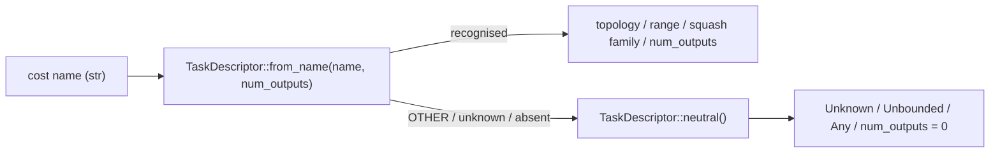

## Summary

Introduce the pure `TaskDescriptor` type and its `from_name` cost-name mapping
in a new `src/analysis/task_descriptor.rs` module. The descriptor summarises
the supervised-learning task shape — target topology, target range, and
output squash family — derived purely from the cost name and the network's
output count. No FFI plumbing, no consumer detector changes, and no I/O are
introduced; those land via the follow-up issues (notably #1314) that
reference this one. Closes #1312.

## Evidence

CLI / library change only — no UI to screenshot. Verified via the new unit
tests (15 cases, all passing) and the full `./quality.sh` gate (clippy with
`-D warnings`, `cargo check --all-targets --all-features`, full test suite,
docs build with `RUSTDOCFLAGS="-D warnings"`, release build).

Mapping (matches the issue table verbatim):

| costName              | topology    | range       | output squash family |
| --------------------- | ----------- | ----------- | -------------------- |
| MSE, MAE              | Independent | Unbounded   | Unbounded            |
| MAPE, MSLE            | Independent | Positive    | Positive             |
| BINARY_CROSS_ENTROPY  | Independent | Unit        | BoundedUnipolar      |
| CROSS_ENTROPY         | Simplex     | Unit        | BoundedUnipolar      |
| HINGE                 | Margin      | SignedUnit  | BoundedBipolar       |
| CATEGORICAL_ERROR     | OneHot      | Unit        | BoundedUnipolar      |
| OTHER / unrecognised  | Unknown     | Unbounded   | Any (= neutral)      |

## Test Plan

Added `src/analysis/task_descriptor.rs::tests` covering:

- `neutral_is_unknown_unbounded_any` — neutral descriptor fields.
- `default_descriptor_equals_neutral` — `Default` matches `neutral()`.
- `mse_maps_to_independent_unbounded_unbounded`
- `mae_maps_to_independent_unbounded_unbounded`
- `mape_maps_to_independent_positive_positive`
- `msle_maps_to_independent_positive_positive`
- `binary_cross_entropy_maps_to_independent_unit_bounded_unipolar`
- `cross_entropy_maps_to_simplex_unit_bounded_unipolar`
- `hinge_maps_to_margin_signed_unit_bounded_bipolar`
- `categorical_error_maps_to_onehot_unit_bounded_unipolar`
- `other_collapses_to_neutral`
- `unrecognised_name_collapses_to_neutral`
- `empty_name_collapses_to_neutral`
- `lookup_is_case_insensitive`
- `num_outputs_is_preserved_verbatim` — including zero, large counts, and
  the unrecognised-name branch (always 0 via neutral).

Quality gate (`./quality.sh`) passes cleanly with all 15 new tests added to
the lib test suite.
