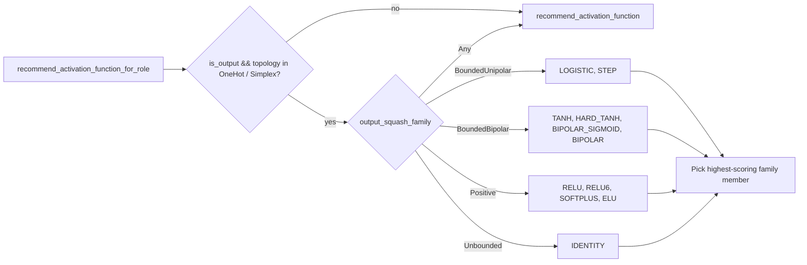

## Summary

Add a role-aware activation recommendation entry point that biases
**output-neuron** squash candidates toward the task descriptor's
`output_squash_family` when the topology constrains the output to a
specific manifold (OneHot, Simplex). Hidden-neuron behaviour and the
neutral / `OTHER` / `Unknown` descriptor path are unchanged — they
defer verbatim to the existing distribution-driven recommender. Closes
#1313.

This is the cold-start fix from the issue: output neurons with
unbounded squashes (LINEAR / RELU / GELU / …) cannot settle on a
one-hot `[0, 1]` manifold, so under a `CATEGORICAL_ERROR` or
`CROSS_ENTROPY` descriptor the recommender now restricts candidates to
the bounded unipolar family (LOGISTIC, STEP).

## Scope

Scoped to the recommendation **path** only (`src/analysis/recommendation/
activation_recommendation.rs`). The activation scan set, bias-drift
weighting, and output competition are intentionally **not** touched —
they are tracked as separate issues. The new function exists alongside
the legacy entry point; FFI ingest of the descriptor is #1314.

## Evidence

Backend-only change with no UI surface. Verified via:

- New integration test file `tests/recommendation/
  issue_1313_role_aware_output_squash.rs` (7 tests, all passing) — covers
  the four acceptance criteria plus three regression guards.
- New inline unit tests in `activation_recommendation.rs` — three
  additional `#[cfg(test)]` cases exercise the bounded family pick,
  hidden-neuron unchanged behaviour, and the neutral descriptor
  fallback.
- `./quality.sh` — full pipeline (fmt, clippy `-D warnings`, doc, lib +
  integration tests, release build) passes cleanly.

## Test Plan

Added to `tests/recommendation/issue_1313_role_aware_output_squash.rs`:

- `one_hot_descriptor_recommends_bounded_unipolar_for_output_neuron` —
  acceptance criterion 1 / 4 (CATEGORICAL_ERROR + IDENTITY output).
- `simplex_descriptor_recommends_bounded_unipolar_for_output_neuron` —
  acceptance criterion 1 (CROSS_ENTROPY + RELU output).
- `neutral_descriptor_falls_back_to_existing_behaviour` — regression
  guard against the `Unknown` / `Any` path.
- `other_cost_descriptor_falls_back_to_existing_behaviour` —
  regression guard for the `OTHER` cost name.
- `one_hot_descriptor_does_not_bias_hidden_neuron_recommendation` —
  acceptance criterion 2 (hidden-neuron path unchanged under OneHot).
- `output_neuron_already_in_family_yields_no_recommendation` — no
  spurious recommendation when the current squash is already
  in-family.
- `insufficient_samples_returns_none_for_output_role` — sample-count
  regression guard.

Added to `src/analysis/recommendation/activation_recommendation.rs`
under `#[cfg(test)] mod tests`:

- `test_role_aware_one_hot_picks_bounded_unipolar`
- `test_role_aware_hidden_unchanged_under_one_hot`
- `test_role_aware_neutral_descriptor_matches_legacy`
