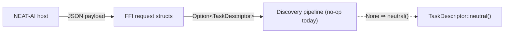

## Summary

Plumbing-only change that lets producers pass an optional `task_descriptor`
through the discovery FFI. The three request structs in
`src/ffi_types/requests.rs` — `RecordDiscoveryInput`, `AnalyzeParallelInput`,
`RankFocusNeuronsInput` — now carry an `Option<TaskDescriptor>` field marked
with `#[serde(default)]`. A payload that omits the field deserialises to
`None`, which consumers treat as `TaskDescriptor::neutral()`. No
recommendation generator reads the field yet, so behaviour is unchanged.

`TaskDescriptor`, `TargetTopology`, `TargetRange`, and `OutputSquashFamily`
gained `serde::Deserialize` derives; `TaskDescriptor` uses
`#[serde(rename_all = "camelCase")]` so producers send the field names in the
same camelCase convention as the rest of the FFI payloads.

Closes #1314.

## Evidence

Backend / FFI-only change; no UI surface to screenshot. The serde round-trip
is verified by the new test module
`tests/ffi/issue_1314_task_descriptor_plumbing.rs`, which covers:

- An omitted `task_descriptor` deserialising to `None` for all three structs
  and `None.unwrap_or_default() == TaskDescriptor::neutral()`.
- A supplied descriptor round-tripping verbatim through serde.
- A payload that supplies every other previously-supported `AnalyzeParallel`
  field still parses cleanly (regression guard).

`./quality.sh` passes locally (fmt, clippy, check, doc, all tests, release
build).

## Test Plan

- New tests in `tests/ffi/issue_1314_task_descriptor_plumbing.rs`:
  - `record_discovery_input_omits_task_descriptor_to_none`
  - `record_discovery_input_supplied_task_descriptor_round_trips`
  - `analyze_parallel_input_omits_task_descriptor_to_none`
  - `analyze_parallel_input_supplied_task_descriptor_round_trips`
  - `analyze_parallel_input_accepts_neutral_descriptor`
  - `rank_focus_neurons_input_omits_task_descriptor_to_none`
  - `rank_focus_neurons_input_supplied_task_descriptor_round_trips`
  - `payload_without_task_descriptor_still_parses_all_existing_fields`
- Existing tests under `src/record/tests.rs` updated to initialise the new
  field with `task_descriptor: None`.
- Full `./quality.sh` run passes.
