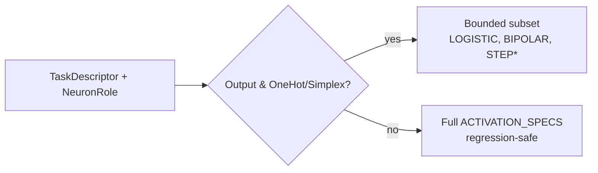

## Summary

Made the activation/squash **scan** candidate set role- and task-aware. Closes #1315.

A new helper `scan_specs_for_role(role, descriptor)` in
`src/analysis/activation/specs.rs` returns the activation candidate specs to
scan for a given neuron role (`Output` / `Hidden`) and `TaskDescriptor`:

- **Output neuron** under `target_topology ∈ {OneHot, Simplex}` → bounded
  subset only (`LOGISTIC`, `STEP`, `BIPOLAR` — the names in
  `BOUNDED_OUTPUT_SCAN_NAMES`; `STEP` is listed for forward compatibility,
  the effective set is currently `LOGISTIC` + `BIPOLAR` since `STEP` is
  not yet in `ACTIVATION_SPECS`).
- **Hidden neuron**, *any* descriptor → full `ACTIVATION_SPECS`.
- **Output neuron** under `Independent` / `Margin` / `Unknown` topology →
  full `ACTIVATION_SPECS` (regression guard for `OTHER` / unrecognised /
  absent cost names, which collapse to `TaskDescriptor::neutral()`).

The helper is pure: it consumes the `TaskDescriptor` from #1312 but does
not depend on the #1314 FFI plumbing. No existing call site is touched —
the scan path keeps its current behaviour until a consumer migration
opts in.

## Evidence

CLI/library change, no UI to screenshot. Verified via tests below.

`*` — `STEP` is listed for forward compatibility; it is silently skipped
while it is absent from `ACTIVATION_SPECS`.

## Test Plan

- `src/analysis/activation/specs.rs::scan_specs_tests` — 9 inline unit
  tests covering OneHot/Simplex × Output/Hidden, `OTHER`, neutral,
  unrecognised, Independent costs, and bounded-subset name validation.
- `tests/activation/issue_1315_role_task_aware_scan.rs` — 7 integration
  tests asserting the public API behaviour and the regression guards.
- `./quality.sh` passes cleanly.
