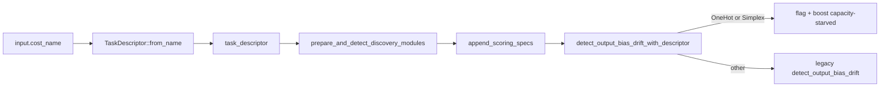

## Summary

Weight output bias-drift detection by class prior for `OneHot` / `Simplex`
target topologies. Output neurons that never cross a saturating threshold
on a class with positive support are flagged as **capacity-starved** and
their estimated improvement is boosted, lifting them in the candidate
ranking for growth. All other descriptors (`Independent`, `Margin`,
`Unknown`, `OTHER`, absent) fall through to the existing detector
verbatim — regression guard. Closes #1316.

## Evidence

Backend Rust crate — no UI surface to screenshot. Verified via TDD with
nine targeted integration tests in
`tests/recommendation/issue_1316_output_bias_drift_one_hot_capacity_starvation.rs`,
all green:

```
test result: ok. 9 passed; 0 failed; 0 ignored; 0 measured;
```

The full crate test suite (`cargo test --lib --tests --all-features
-- --test-threads=2`) also passes; `cargo clippy --all-targets
--all-features -- -D warnings` passes; `cargo fmt --all -- --check`
clean; `RUSTDOCFLAGS="-D warnings" cargo doc --no-deps` builds.

### Dispatch wiring



## Test Plan

Tests added in
`tests/recommendation/issue_1316_output_bias_drift_one_hot_capacity_starvation.rs`:

- `one_hot_descriptor_flags_capacity_starved_output_neuron` — positive
  support + activation stuck below the saturating threshold under
  `CATEGORICAL_ERROR` → `capacity_starved == true`.
- `simplex_descriptor_flags_capacity_starved_output_neuron` — same under
  `CROSS_ENTROPY` (Simplex topology).
- `one_hot_does_not_flag_well_saturated_output` — activations cross
  the saturating threshold → never flagged.
- `neutral_descriptor_matches_legacy_detector` — regression guard for
  `TaskDescriptor::neutral()`.
- `other_cost_matches_legacy_detector` — regression guard for the
  `OTHER` cost name.
- `mse_descriptor_matches_legacy_detector` — regression guard for the
  `Independent` topology.
- `class_without_positive_support_is_not_flagged` — class prior
  matters: no positive-support records ⇒ no capacity-starved flag.
- `capacity_starved_candidate_is_weighted_up_vs_legacy` — verifies the
  estimated improvement of a capacity-starved candidate is strictly
  greater than the legacy detector's gain on the same input.
- `hidden_neuron_is_not_flagged_capacity_starved` — output-only
  detector continues to ignore hidden neurons under the role-aware
  path.
