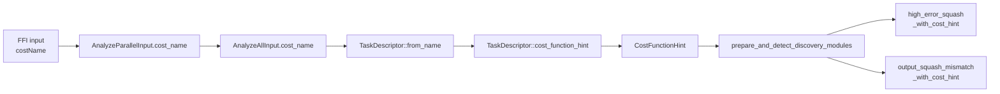

# Wire the cost identity into the target-reconstruction guard (Issue #1317)

## Summary

Feeds the real cost-function identity into the implied-target reconstruction
guard introduced for Issue #1250 so the two reconstruction-dependent
detectors run only when the recorded error is provably a linear residual.
Closes #1317.

Two detectors reconstruct an "implied target" as `activation ± error`:

- `detection::output_squash_mismatch` Strategy 4 (pre-activation squash
  comparison).
- `detection::high_error_squash_exploration`.

Both were already cost-aware at the API level (the `_with_cost_hint`
variants from Issue #1250) but the dispatch path always invoked the
legacy entry point and so always evaluated as if the cost were
`CostFunctionHint::Unknown`. This change threads the actual cost name
through to the dispatch layer and converts it into a `CostFunctionHint`
via `TaskDescriptor`.

### Behaviour matrix

| Cost name | `TaskDescriptor` | `CostFunctionHint` | Detectors |
|-----------|------------------|--------------------|-----------|
| `MSE`, `MAE`, `BINARY_CROSS_ENTROPY`, `CROSS_ENTROPY` | linear-residual shape | `LinearResidual` | run |
| `MAPE`, `MSLE`, `HINGE`, `CATEGORICAL_ERROR` | non-linear-residual shape | `NonLinearResidual` | skipped |
| `OTHER` / unrecognised / absent | `neutral()` | `NonLinearResidual` (conservative skip) | skipped |

### Changes

- `src/analysis/task_descriptor.rs`: new `TaskDescriptor::cost_function_hint()`
  projection. Neutral / unknown descriptors map to `NonLinearResidual` so
  the dispatch boundary conservatively skips the reconstruction-dependent
  detectors when the cost shape is unknown.
- `src/ffi_types/requests.rs`: `AnalyzeParallelInput` and `AnalyzeAllInput`
  gain an optional `cost_name: Option<String>` (camelCase JSON `costName`).
  Absent / `null` deserialises to `None`. Existing payloads continue to
  parse unchanged.
- `src/ffi_internal/analysis.rs`: forwards `cost_name` from
  `AnalyzeParallelInput` into `AnalyzeAllInput`.
- `src/analysis/orchestration.rs`: derives a `CostFunctionHint` from
  `input.cost_name` + `input.creature.output` at the top of `analyze_all`
  and forwards it into the discovery dispatch path.
- `src/analysis/module_dispatch_specs/{mod.rs,neuron_specs.rs,scoring_specs.rs}`:
  `build_discovery_module_specs`, `prepare_and_detect_discovery_modules*`,
  `append_neuron_specs`, and `append_scoring_specs` all take a
  `CostFunctionHint` parameter. The high-error squash exploration and
  output-squash-mismatch dispatch specs now call the `_with_cost_hint`
  detector variants.

### Data-flow

## Evidence

This is a backend wiring change with no UI surface. Verified by:

- New tests in
  `tests/analysis/issue_1317_cost_identity_wiring.rs` covering:
  - `TaskDescriptor::cost_function_hint()` mapping for every recognised
    cost name plus `OTHER`, unrecognised, empty, and neutral.
  - Both reconstruction-dependent detectors gated correctly under
    `LinearResidual`, `NonLinearResidual`, and `neutral` hints.
  - FFI round-trip of the new optional `costName` field on
    `AnalyzeParallelInput` (with and without the field present).
- New unit tests inside `src/analysis/task_descriptor.rs` cover the new
  projection for the seven built-in costs plus neutral / `OTHER`.
- Existing Issue #1250 detector tests
  (`tests/detection/issue_1250_implied_target_cost_hint.rs`) continue to
  pass unchanged — the underlying `CostFunctionHint::Unknown` semantics
  are preserved so legacy detector callers see no behaviour change.

## Test Plan

- [x] `cargo test --lib --all-features -- --test-threads=2` (1068 passed).
- [x] `cargo test --test analysis --all-features -- --test-threads=2` (590 passed).
- [x] `cargo test --test detection issue_1250 …` (7 passed, unchanged).
- [x] `cargo test --test analysis issue_1317 …` (7 new passed).
- [x] `cargo test --test analysis issue_930 …` (3 passed — confirms the
      conservative-skip default does not regress the change-squash
      discovery test, which relies on other detectors).
- [x] `cargo clippy --all-targets --all-features -- -D warnings` clean.
- [x] `cargo fmt --all -- --check` clean.
- [x] `RUSTDOCFLAGS="-D warnings" cargo doc --no-deps --all-features`
      clean.

## Notes for reviewers

- Issue #1314 (FFI plumbing for `task_descriptor: Option<TaskDescriptor>`)
  is still open. This change introduces a narrower equivalent
  (`cost_name: Option<String>`) needed by Issue #1317; the broader
  descriptor field from #1314 can replace it when that issue lands.
- Existing `AnalyzeAllInput` construction sites in tests and benches have
  been updated to supply the new field as `cost_name: None`, preserving
  their original behaviour (conservative skip — same as the pre-#1250
  detector emit-but-don't-recommend behaviour would now be unsafe to
  assume by default).
