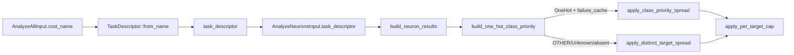

## Summary

Under a `OneHot` task descriptor (e.g. `CATEGORICAL_ERROR`) the growth /
candidate budget for add-neuron candidates now skews toward output neurons
(classes) with the highest per-target failure counts, reusing the existing
failure signal already supplied via `failure_cache` (Issue #1131, #1194)
and documented on the per-target trackers in
`src/analysis/within_batch_failures.rs` and
`src/analysis/target_failure_tracker.rs`. The cost identity confirms the
outputs are exchangeable classes, so per-class allocation is well-defined.
For every other descriptor (`Independent`, `Margin`, `Simplex`, `Unknown`,
`OTHER`, absent) the existing allocation runs verbatim — regression
guard. Closes #1319.

## Evidence

Backend Rust crate — no UI surface to screenshot. Verified via TDD with a
new pure module
[`src/analysis/one_hot_class_allocation.rs`](../../../src/analysis/one_hot_class_allocation.rs)
plus a dedicated integration test file
[`tests/recommendation/issue_1319_one_hot_per_class_capacity_allocation.rs`](../../../tests/recommendation/issue_1319_one_hot_per_class_capacity_allocation.rs)
and inline unit tests inside the neuron post-processing module. The full
`./quality.sh` gate passes cleanly:

```
test result: ok. 16 passed; 0 failed; 0 ignored; 0 measured (neuron::post_processing)
test result: ok. 4 passed; 0 failed; 0 ignored; 0 measured (one_hot_class_allocation)
test result: ok. 6 passed; 0 failed; 0 ignored; 0 measured (tests/recommendation/issue_1319)
✅ All quality checks passed!
```

### Allocation dispatch



## Test Plan

Integration tests in
`tests/recommendation/issue_1319_one_hot_per_class_capacity_allocation.rs`:

- `one_hot_descriptor_computes_per_class_failure_counts` — under
  `CATEGORICAL_ERROR`, aggregates per-output-neuron failures from the
  failure cache; hidden / non-output targets are excluded; classes with
  zero failures are omitted.
- `neutral_descriptor_yields_no_class_failure_counts` — `neutral`,
  `MSE`, `OTHER`, and `HINGE` descriptors all return `None`, opting out
  of per-class allocation (regression guard).
- `class_priority_spread_pulls_worst_classes_to_front` — the highest-
  failure classes occupy the front of the reordered list before the
  per-target cap is applied.
- `empty_priority_map_is_a_noop` — an empty priority map preserves the
  gain-sorted order verbatim.
- `class_priority_spread_keeps_highest_gain_representative` — within
  each priority slot, the highest-gain candidate is chosen.
- `class_priority_spread_falls_through_when_pool_too_narrow` — when the
  pool contains fewer distinct targets than the spread requires, the
  list is left untouched.

Inline unit tests in `src/analysis/one_hot_class_allocation.rs`:

- `one_hot_aggregates_failures_per_output_class`
- `non_one_hot_topologies_return_none` (covers MSE, MAE, MAPE, BCE, CE, HINGE)
- `empty_failure_cache_under_one_hot_returns_empty_map`
- `non_output_targets_are_skipped`

Inline unit tests in `src/analysis/neuron/post_processing.rs`:

- `per_target_cap_with_priority_pulls_high_priority_targets_to_front` —
  end-to-end check that `apply_per_target_cap_with_priority` lets the
  priority spread reach the emitted batch.
- `per_target_cap_with_no_priority_matches_legacy_path` — regression
  guard: `None` priority is byte-identical to the existing path.
- `per_target_cap_with_empty_priority_uses_legacy_spread` — empty
  priority map preserves the gain-sorted order.
