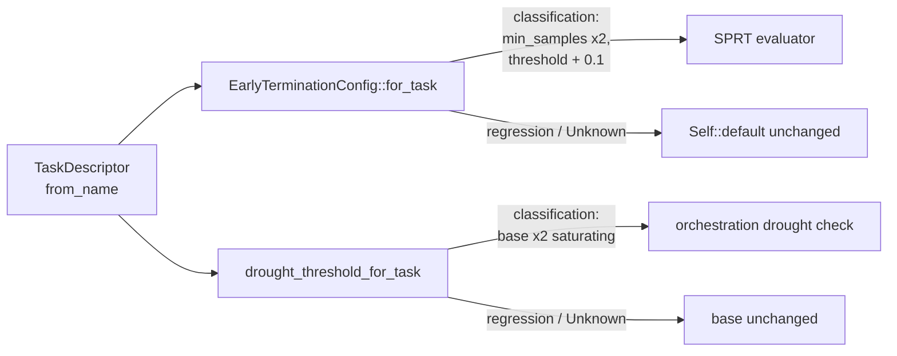

## Summary

Calibrated the SPRT early-termination config and the drought-diagnostic
threshold by the `TaskDescriptor` so classification runs are not stopped
prematurely or falsely flagged as in drought. Absolute error scale is
cost-dependent — a `0.1` categorical error already implies ~90% accuracy
(excellent), while a `0.1` MSE is mediocre — so per-sample improvement
signal is sparser on classification tasks and the thresholds must move
accordingly. Closes #1320.

Regression guard: `OTHER` / `Unknown` / neutral descriptors and any
`Independent` (regression) topology return the existing defaults
unchanged.

## Changes

- `src/analysis/early_termination.rs`
  - New `EarlyTerminationConfig::for_task(&TaskDescriptor)`. Classification
    topologies (`OneHot`, `Simplex`, `Margin`) double `min_samples` and lift
    the SPRT `threshold` by `0.1` above the 50% baseline. Everything else
    returns `Self::default()`.
- `src/analysis/drought_diagnostic.rs`
  - New `drought_threshold_for_task(base, &TaskDescriptor)`. Classification
    topologies multiply the base by `CLASSIFICATION_DROUGHT_MULTIPLIER` (2,
    saturating) so the warn / `droughtDiagnostic` fire point sits later.
    Other topologies return `base` unchanged.
- `src/analysis/orchestration.rs`
  - Wired `drought_threshold_for_task` into the drought-emission path, using
    the `task_descriptor` already computed earlier in `analyze_all`.

## Evidence

Backend-only change (no UI). Verified by the test suite:

- `tests/issue_1320_task_calibrated_thresholds.rs` — 15 new tests covering:
  - Neutral / `OTHER` / unrecognised / MSE descriptors return unchanged
    config + drought threshold (regression guard).
  - `CATEGORICAL_ERROR`, `CROSS_ENTROPY`, `HINGE` descriptors require
    strictly more samples and a stricter SPRT threshold than default.
  - `CROSS_ENTROPY` and `HINGE` share the classification profile with
    `CATEGORICAL_ERROR`.
  - Evaluator built from a calibrated config inherits the larger
    `min_samples` and does not short-circuit `is_strongly_beneficial` until
    the calibrated minimum is reached.
  - Drought threshold is larger for all three classification costs.
  - Drought threshold saturates safely at `u32::MAX`.
- `./quality.sh` ran clean (fmt, clippy `-D warnings`, full test suite,
  rustdoc, release build).

## Test Plan

- [x] New tests added in `tests/issue_1320_task_calibrated_thresholds.rs`
      (15 cases — regression-guard, classification-stricter, evaluator
      wiring, drought saturation).
- [x] No existing tests modified.
- [x] `./quality.sh` passes locally.
