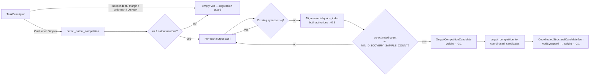

## Summary

Adds an output-competition / lateral-inhibition recommender gated by the
task descriptor. Under `OneHot` / `Simplex` topologies it proposes
inhibitory `AddSynapse(output_a → output_b)` operations when two output
neurons co-fire strongly on the same samples; under every other topology
(`Independent`, `Margin`, `Unknown` / `OTHER` / absent) it emits nothing,
satisfying the regression guard in the acceptance criteria. Closes #1321.

This is the stretch item in the cost-name milestone, landing after
the bounded-squash (#1313) and bias-drift (#1316) work as required by
the issue's ordering constraint.

## Evidence

Backend-only crate change with no UI surface. Verified via the unit and
integration tests below; full `./quality.sh` passes (clippy, fmt,
`cargo doc`, `cargo deny`, `cargo test --lib --tests --all-features`,
release build).

### Recommender flow

## Test Plan

Added `tests/recommendation/issue_1321_output_competition_lateral_inhibition.rs`
with 11 integration tests covering both acceptance criteria:

- `one_hot_descriptor_emits_inhibitory_recommendation` — OneHot + co-firing outputs ⇒ candidate emitted, weight < 0.
- `simplex_descriptor_emits_inhibitory_recommendation` — `CROSS_ENTROPY` ⇒ candidate emitted.
- `unknown_descriptor_emits_nothing` — neutral descriptor regression guard.
- `other_descriptor_emits_nothing` — `OTHER` regression guard.
- `independent_descriptor_emits_nothing` — `MSE` regression guard.
- `margin_descriptor_emits_nothing` — `HINGE` regression guard.
- `single_output_emits_nothing` — networks with only one output cannot compete.
- `non_competing_outputs_emit_nothing` — disjoint firing patterns are not flagged.
- `existing_synapse_is_not_duplicated` — pre-existing `output-a → output-b` skips the pair.
- `coordinated_candidates_use_add_synapse_with_negative_weight` — converter emits `AddSynapse` with negative weight.
- `forward_only_ordering_is_respected` — `from` precedes `to` in `creature.neurons[]`.

Three additional in-module unit tests cover the `co_activation` helper
and the gating shortcut.

## Files Changed

- `src/analysis/recommendation/output_competition.rs` — new recommender module.
- `src/analysis/recommendation/mod.rs` — register the new module.
- `tests/recommendation/issue_1321_output_competition_lateral_inhibition.rs` — integration tests.
- `tests/recommendation/main.rs` — register the new test module.
