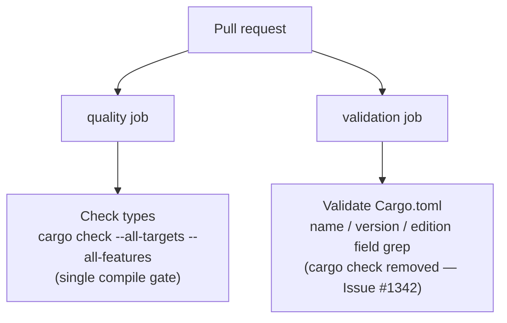

# PR Summary — Issue #1342

## Summary

Removed the duplicate `cargo check` from `.github/workflows/ci.yml`. The crate
was compiled twice on every pull request:

- `quality` job → **Check types** — `cargo check --all-targets --all-features`
- `validation` job → **Validate Cargo.toml** — `cargo check --manifest-path Cargo.toml --quiet`

The two jobs run concurrently (no `needs:` relationship between them), and the
`validation` invocation compiled only the default target — a strict subset of
the `quality` invocation's `--all-targets --all-features` scope. It therefore
added no coverage while doubling the most expensive part of the `validation`
job and consuming extra runner capacity.

The redundant `cargo check` is dropped from the **Validate Cargo.toml** step,
leaving its genuinely distinct work (the `name`/`version`/`edition`
field-presence grep) intact. Manifest resolvability is still proven by the
`quality` job's `cargo check --all-targets --all-features` on the same pull
request. The now-stale "lightweight cargo check" comment on the `validation`
job header was updated to match.

Closes #1342.

## Evidence

This is a CI workflow / build-config change with no web interface to
screenshot. The change is verified by a new regression test that parses
`ci.yml` and asserts the de-duplication, plus the existing workflow tests
which confirm no other workflow invariant regressed.



Test run (after fix):

```
running 3 tests
test check_types_step_retains_broad_compile_gate ... ok
test validate_cargo_toml_step_has_no_cargo_check ... ok
test validate_cargo_toml_step_keeps_field_presence_validation ... ok

test result: ok. 3 passed; 0 failed; 0 ignored; 0 measured; 0 filtered out
```

## Test Plan

Added `tests/issue_1342_workflow_dedup_cargo_check.rs`, which reproduces #1342
and verifies the fix:

- `validate_cargo_toml_step_has_no_cargo_check` — fails against the unfixed
  workflow (the step ran `cargo check`); passes after the redundant check is
  removed.
- `validate_cargo_toml_step_keeps_field_presence_validation` — confirms the
  step still validates the `name`/`version`/`edition` fields (its unique work
  is preserved).
- `check_types_step_retains_broad_compile_gate` — confirms the `quality` job's
  `Check types` step retains `cargo check --all-targets --all-features` as the
  single compile gate.

Existing workflow tests re-run to confirm no regression:
`issue_1290_workflow_set_euo_pipefail`, `issue_1292_actionlint_workflow`,
`issue_1287_workflow_timeouts` — all pass.
