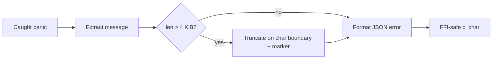

## Summary

`panic_to_ffi_json` (`src/ffi/helpers.rs`) caught a panic at the FFI boundary
and embedded the **full** panic message into a JSON error string. The message
was unbounded — a panic carrying a large payload produced an arbitrarily large
allocation that was then escaped (further inflating the worst case) and
marshalled across the Deno FFI boundary, undermining the "Never panics itself"
cheap-path guarantee.

This change truncates the panic message to a fixed 4 KiB cap on a UTF-8 char
boundary before formatting, appending an explicit `… (truncated)` marker. The
existing `CString::new` fallback for non-representable messages is retained.

Closes #1365.

## Change detail

- Added `MAX_PANIC_MSG_BYTES` (4096) and `TRUNCATION_MARKER` constants.
- Added `truncate_panic_msg`, which returns a borrowed `Cow` when the message
  already fits, and otherwise walks back to the nearest char boundary at or
  below the cap before appending the marker — so a multi-byte UTF-8 sequence is
  never split.
- `panic_to_ffi_json` now truncates before building the JSON error string. The
  embedded message is bounded to `MAX_PANIC_MSG_BYTES + TRUNCATION_MARKER.len()`.

## Evidence

Backend/FFI-only change — no web interface to screenshot. Verified via unit
tests in `src/ffi/helpers.rs` and the full `./quality.sh` gate (fmt, clippy,
check, tests, doc build, release build) passing cleanly.

## Test Plan

New tests in `src/ffi/helpers.rs`:

- `test_panic_to_ffi_json_truncates_oversized_message` — constructs a panic
  payload of `4 × cap` bytes, asserts the returned `error` field is bounded
  (≤ cap + marker), ends with the marker, and still parses as valid JSON.
- `test_truncate_panic_msg_respects_char_boundary` — uses 3-byte multi-byte
  chars straddling the cap and asserts truncation lands on a char boundary
  (no panic / no split sequence).
- `test_truncate_panic_msg_short_message_unchanged` — messages within the cap
  are returned unchanged.

Existing panic-to-JSON tests stay green (9 tests pass in `ffi::helpers`).
