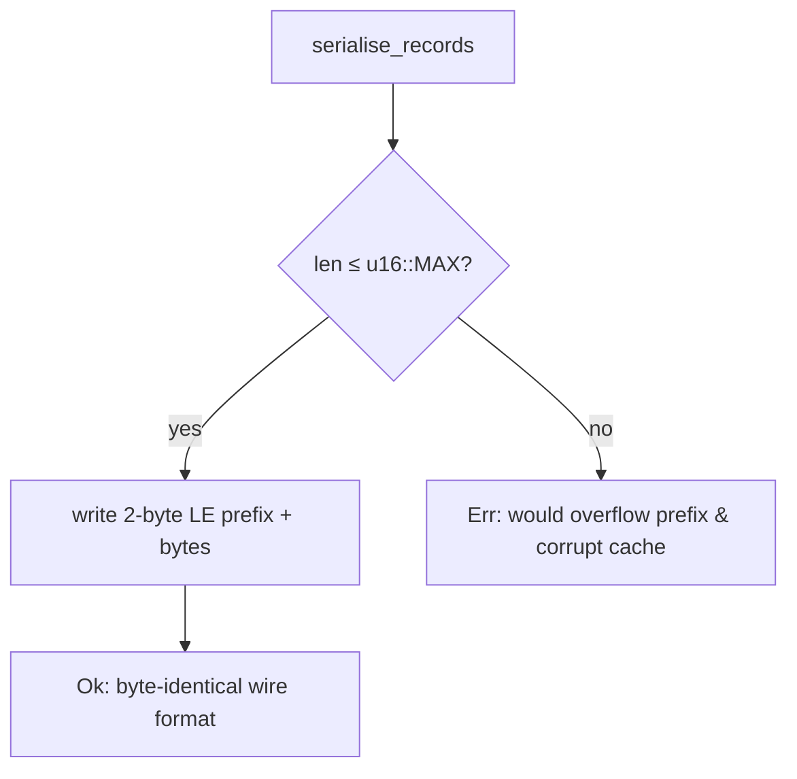

## Summary

Guarded the discovery cache binary serialiser against silent `u16`
length-prefix overflow. `serialise_records` wrote the `neuron_uuid` and
`errors` lengths with a bare `len as u16` cast, which silently truncates any
length ≥ 65 536. Because the deserialiser reads the truncated prefix back, an
over-long value round-tripped as **silently corrupted data** — the reader
consumed the wrong number of bytes and mis-parsed every subsequent record with
no error surfaced.

A single shared helper, `push_len_u16`, now bounds-checks the length against
`u16::MAX` before the cast and returns a clear error instead of truncating. It
is used at both serialisation sites. The on-disk wire format is unchanged for
all valid (in-range) records. `serialise_records` and
`CompressedCacheEntry::new` now return `Result`; the sole runtime caller
(`CompressedLruRecordCache::get`) already returns `Result` and propagates the
error with `?`.

Closes #1366.

## Evidence

Backend/CLI change only — no web interface to screenshot. Verified via unit
tests (`cargo test --lib --all-features serialis`) and the full `./quality.sh`
gate, which passed cleanly (`✅ All quality checks passed!`).

The guarding behaviour is covered by:

- `serialise_records_rejects_oversize_errors` — a record with an `errors`
  vector of `u16::MAX + 1` elements returns `Err` rather than a buffer that
  mis-deserialises.
- `serialise_records_rejects_oversize_uuid` — a `neuron_uuid` of
  `u16::MAX + 1` bytes returns `Err`.
- `serialise_records_max_length_boundary_is_accepted` — exactly `u16::MAX`
  still fits the prefix and round-trips cleanly.
- `serialise_records_normal_sizes_are_byte_identical` — normal-sized records
  serialise to exactly the bytes the wire format defines, confirming the guard
  left the format unchanged.

## Test Plan

Added to `src/analysis/cache/serialisation.rs`:

- `serialise_records_rejects_oversize_errors`
- `serialise_records_rejects_oversize_uuid`
- `serialise_records_max_length_boundary_is_accepted`
- `serialise_records_normal_sizes_are_byte_identical`

Updated existing tests to the new `Result` signatures
(`deserialise_records_round_trip`, `decompress_valid_data_round_trip`). No
existing tests were removed or skipped.

All 18 tests in the module pass; `./quality.sh` passes end to end.
