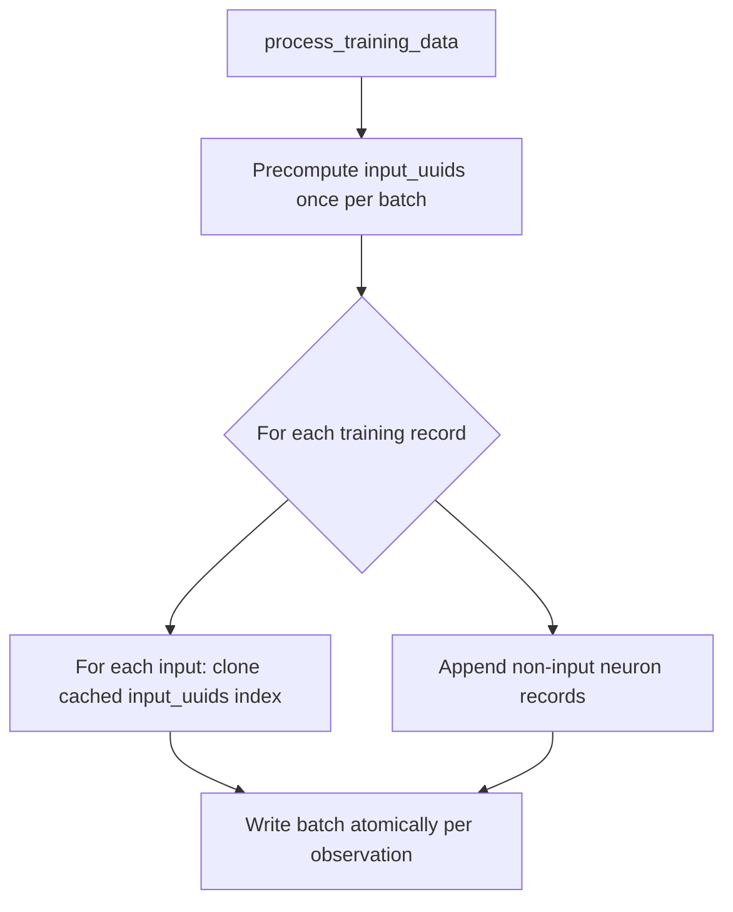

# Precompute input-neuron UUID strings instead of formatting per observation

## Summary

`src/record/processing.rs` allocated a fresh `String` for every input on every
training record — `format!("input-{input_index}")` ran inside the inner
per-observation loop, so the fixed set of input UUIDs (`input-0`, `input-1`, …)
was re-formatted `n_records × n_inputs` times. The set is constant for the whole
batch, so this was pure, avoidable allocation churn on the recording hot path.

The UUIDs are now precomputed **once per batch** into a `Vec<String>` (sized to
the widest training record), and the per-observation loop performs an in-bounds
cache lookup plus a single `String` clone. Behaviour is identical — the same
`input-N` UUIDs and values are recorded for every observation.

The minimal-scope cached-`String` clone was chosen over an `Arc<str>` handle:
`DiscoverRecord::neuron_uuid` is an owned `String` used across serialisation and
many callers, so threading an `Arc<str>` through it would be invasive and out of
scope for this issue.

Closes #1368.

## Evidence

This is a backend/CLI change with no web interface to screenshot. Evidence is a
criterion micro-benchmark (`benches/input_uuid_precompute.rs`) isolating the two
strategies — `format!` per observation (old) vs precompute-once-and-clone (new):

| Workload (records × inputs) | Format per observation (old) | Precompute once (new) | Improvement |
|-----------------------------|------------------------------|-----------------------|-------------|
| 2,000 × 32                   | 2.3805 ms                    | 1.3778 ms             | ~42% faster |
| 2,000 × 128                  | 9.7641 ms                    | 5.2985 ms             | ~46% faster |
| 5,000 × 64                   | 14.901 ms                    | 6.9152 ms             | ~54% faster |

Run with:

```bash
cargo bench --bench input_uuid_precompute
```

### Recording data flow



## Test Plan

- Added `src/record/tests.rs::test_record_discovery_data_input_uuids_stable_across_observations`
  — records three observations with two inputs each, reads the Parquet back, and
  asserts `input-0` / `input-1` records carry the correct `obs_index`, value, and
  activation for every observation (regression guard pinning the unchanged
  behaviour).
- Existing record-processing tests stay green (13 `record::tests` pass), confirming
  identical UUIDs are recorded.
- Full `./quality.sh` passes (fmt, clippy `-D warnings`, check, tests, doc, release build).
