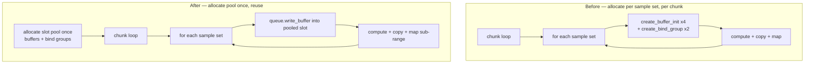

# Reuse GPU buffers across batch chunks in helpful-neuron evaluation

## Summary

`GpuAnalyzer::evaluate_helpful_batch` (`src/analysis/gpu/helpful_evaluation.rs`)
previously allocated fresh GPU buffers with `create_buffer_init` and rebuilt
bind groups for **every sample set in every chunk**. For a discovery run that
splits its sample sets into many chunks, this CPU-side marshalling cost is paid
repeatedly on the GPU critical path.

This change allocates a small pool of reusable per-slot buffers **once** before
the chunk loop, sized to the worst-case sample length, and refills them per
chunk with `queue.write_buffer` instead of `create_buffer_init`. Bind groups are
built once over the stable pooled buffers and reused for the lifetime of the
call. The final short chunk simply writes a leading sub-range and dispatches its
own count; every shader read is bounded (`uniforms.length` in the helpful shader,
`contribution_count` in the reduce shader), so stale tail bytes from a previous
chunk are never read and results stay **bit-identical**.

No `create_buffer_init` call remains inside the per-chunk loop.

Closes #1369. Part of #1364.

## Evidence

### Performance (Apple M4 Pro, Metal)

Benchmark `benches/gpu_helpful_chunk_reuse.rs` drives 96 sample sets of 256
samples through `evaluate_helpful_batch` at small batch sizes, so the number of
chunks (and therefore the per-chunk allocation overhead) dominates. Criterion
`change` is the before→after comparison on the same machine.

| Batch size | Chunks | Before (median) | After (median) | Change |
|-----------:|-------:|----------------:|---------------:|-------:|
| 2          | 48     | 1.2877 s        | 1.2911 s       | +0.26 % (p=0.29, not significant — noise) |
| 4          | 24     | 652.18 ms       | 624.44 ms      | **−4.25 %** (p<0.05) |
| 8          | 12     | 332.22 ms       | 316.53 ms      | **−4.72 %** (p<0.05) |

Statistically significant improvement at batch sizes 4 and 8; batch size 2 is
within measurement noise (no regression). The relative gain grows with the
number of sample sets per call, because allocations are now capped at the pool
size instead of scaling with the total number of sample sets.

### Buffer lifecycle — before vs after

### Correctness

GPU-only path (CI skips GPU tests). Verified locally via `./quality.sh` on an
Apple M4 Pro. The new tests assert the core invariant the optimisation must
preserve — results are **bit-identical** regardless of how sample sets are split
into chunks (a sample set is computed wholly within one chunk, so its statistics
must not depend on the chunking that drives buffer reuse). Float fields are
compared by exact bit pattern (`f32::to_bits`).

## Test Plan

- `tests/gpu/issue_1369_buffer_reuse_chunking.rs`:
  - `test_helpful_batch_chunking_is_bit_identical` — a mix of empty, small,
    medium and a reduction-path (≥10k) set evaluated at batch sizes 1/2/3/5/64;
    all results must be bit-identical to the single-chunk reference, exercising
    both the per-sample and GPU-reduction paths through the reused pool.
  - `test_helpful_batch_repeated_set_no_state_leak` — the same set repeated five
    times across multiple chunks yields identical stats every time (no stale
    state leaks between chunk reuses).
- These tests pass against both the original and new implementations (the
  invariant holds either way), so they are a durable regression guard rather
  than implementation-coupled.
- `benches/gpu_helpful_chunk_reuse.rs` — new benchmark providing the before/after
  timing evidence above.
- Full `./quality.sh` passes (fmt, clippy `-D warnings`, check, tests, doc,
  release build).
