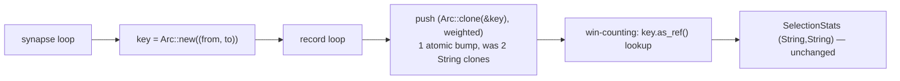

# Avoid residual per-record synapse-key tuple clones in impact attribution

## Summary

`compute_min_stats` / `compute_max_stats` in `src/focus/impact.rs` build a
per-observation map of synapse contributions. Issue #976 hoisted the
`(from_uuid, to_uuid)` key out of the inner records loop, but the residual
`key.clone()` still cloned **two heap `String`s per record per synapse** when
pushing into `obs_contributions`.

This change wraps the key once as `Arc<(String, String)>` outside the records
loop and `Arc::clone`s it per push — turning two `String` allocations per record
into a single atomic refcount bump. The key is only ever hashed/compared
downstream (`win_counts` lookup, never mutated), so the swap is transparent and
impact-attribution outputs are unchanged.

Closes #1370.

## What changed

- `SynapseContribution` type alias: `((String, String), f32)` →
  `(Arc<(String, String)>, f32)`.
- Per-record push now uses `Arc::clone(&key)` instead of `key.clone()`.
- The `win_counts` win-counting loop dereferences the `Arc` (`key.as_ref()`) for
  its `HashMap<(String, String), u32>` lookup/insert. `win_counts` and the
  `SelectionStats` output type are unchanged, so the downstream consumer
  (`compute_impact_with_shared_cache`) needs no changes.

## Evidence (performance)

Backend-only change — no UI. Justified with the existing focus benchmark
(`benches/impact_uuid_cloning.rs`). The pre-existing cases drove
`compute_impacts_public` with `None` records, which never reaches the selection-
stats path; a `selection_stats_records` group was added that drives
`compute_impacts_with_activations` with an in-memory record provider over
MINIMUM neurons, exercising `compute_min_stats` directly.

| Benchmark case | Before | After | Change |
|---|---|---|---|
| `min_20inputs_500obs` | 943.4 µs | 418.6 µs | **−56.2 %** |
| `min_100inputs_1000obs` | 8.338 ms | 2.020 ms | **−75.8 %** |
| `min_200inputs_2000obs` | 40.57 ms | 7.372 ms | **−81.8 %** |

Criterion reported `p = 0.00 < 0.05` ("Performance has improved") for all three
cases. The gain grows with record count, confirming the win is allocation-bound
as predicted.

## Test Plan

- **New** `tests/focus/issue_1370_arc_synapse_key.rs`:
  - `minimum_win_proportional_impact_is_unchanged` — MINIMUM neuron where one
    synapse wins 3/4 observations gets 0.75 impact, the other 0.25.
  - `maximum_ties_split_impact_equally` — every-observation tie drives the
    multi-winner branch of the win-counting loop; both synapses get win
    probability 1.0.
- **Existing, stay green** — `tests/activation/activation_based_impact.rs`
  (MIN/MAX/IF selection-stats correctness) and the full `tests/focus` suite
  (161 tests) confirm impact-attribution outputs are unchanged.
- Quality gate: `cargo clippy --all-targets --all-features -- -D warnings`,
  `cargo check --all-targets --all-features`, and the doc build all pass. (The
  `quality.sh` dependency-upgrade step hit a transient crates.io network error
  unrelated to this change; the code-quality steps were run directly.)
