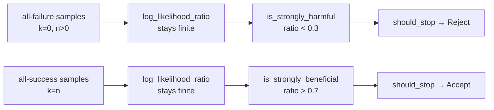

## Summary

Added two extreme boundary tests for the early-termination SPRT in
`tests/analysis/early_termination.rs`, covering the all-failure (`k = 0, n > 0`)
and all-success (`k = n`) inputs that the existing suite never exercised. These
are the boundary of the "certain harm / certain benefit" regime and the inputs
most likely to expose a `log(0)` / divide-by-zero / saturation bug in the
log-likelihood-ratio and SPRT-bound maths.

No production change was required: `SequentialEvaluator::new` already clamps
`alpha`/`beta` away from 0/1, `log_likelihood_ratio` clamps `p0`/`p1` to a valid
range, and the `is_strongly_harmful` / `is_strongly_beneficial` heuristics drive
the correct early decision. Both extremes produce a finite LLR and the expected
`Reject` / `Accept` decision well before all samples are consumed. The tests now
stand as regression guards.

Closes #1371. Part of #1364.

## Evidence

Backend/test-only change — no web interface to screenshot. Verified via the
test suite:

```
running 14 tests
test early_termination::test_all_failures_triggers_early_reject ... ok
test early_termination::test_all_successes_triggers_early_accept ... ok
... (12 existing tests) ...
test result: ok. 14 passed; 0 failed
```

`./quality.sh` passes cleanly (fmt, clippy, check, full test suite, release build).

Both new tests assert on the **observable decision** and LLR finiteness (the
WHAT), not internal counters (the HOW), consistent with the test-audit direction
in #2689 / #2690.



## Test Plan

- Added `tests/analysis/early_termination.rs::test_all_failures_triggers_early_reject`
  — feeds 1000 all-negative samples; asserts the LLR stays finite on every step
  and the evaluator reaches `Reject` before consuming all samples, with the
  positive count remaining zero.
- Added `tests/analysis/early_termination.rs::test_all_successes_triggers_early_accept`
  — symmetric all-positive case; asserts a finite LLR and an early `Accept`, with
  the negative count remaining zero.
- All 14 tests in the module pass; full `./quality.sh` gate is green.
