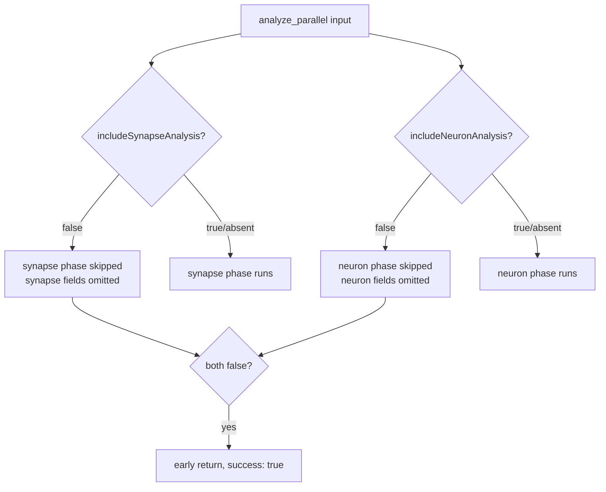

# Document phase-gating fields in FFI_API.md

## Summary

`AnalyzeAllInput` (used by `analyze_parallel`) exposes two optional booleans —
`includeSynapseAnalysis` and `includeNeuronAnalysis` — that let a caller skip an
entire analysis phase, enabling neuron-only or synapse-only discovery. These
fields were undocumented in `docs/FFI_API.md`, making the capability invisible to
FFI callers and easy to break unknowingly.

This change adds a **Phase Gating** subsection to the *Analysis Parameters*
section of `docs/FFI_API.md` documenting both fields: wire names, optional `bool`
type, default of `true`, and the precise skip behaviour. Closes #1372.

The skip-output shape was verified against the source before writing:

- `src/analysis/orchestration.rs:270-271` — both default to `true` via
  `unwrap_or(true)`.
- `src/analysis/orchestration.rs:507-540` — when a flag is `false` the matching
  phase input is `None`, so the phase is skipped and no GPU work is submitted.
- `src/ffi_internal/analysis.rs:97-208` — a skipped phase yields `None` for every
  one of its output fields, and each such field carries
  `#[serde(skip_serializing_if = "Option::is_none")]`
  (`src/ffi_types/responses/analysis.rs`), so the fields are **omitted** from the
  response JSON rather than emitted as empty values.
- When both flags are `false`, `analyze_all` returns early
  (`orchestration.rs:319-331`) and the call still reports `success: true`.

The documented contrast — a **missing** field means "phase not run", whereas an
empty array means "phase ran, no candidates" — follows directly from this code.

## Evidence

Documentation-only change — no web interface to screenshot and no Rust source
modified. Verification performed:

- `markdownlint-cli2 docs/FFI_API.md` → **0 error(s)** under the repo's
  `.markdownlint-cli2.jsonc` config.
- Field names, defaults, and skip behaviour cross-checked against
  `src/ffi_types/requests.rs`, `src/analysis/orchestration.rs`,
  `src/ffi_internal/analysis.rs`, and `src/ffi_types/responses/analysis.rs`
  (see Summary).

No Rust code was changed, so the compile/clippy/test steps of `./quality.sh`
exercise unchanged source; the relevant gate for this change is markdownlint,
which passes.

## Test Plan

No new automated tests — this is a documentation-only change and the gating
behaviour it describes is already exercised by existing tests that construct
`AnalyzeAllInput` with these fields (e.g.
`src/analysis/implementation_tests/synapse_analysis_tests.rs:714-715`). Adding a
source-grep "test" for the doc text would violate the repo's testing guidelines.
