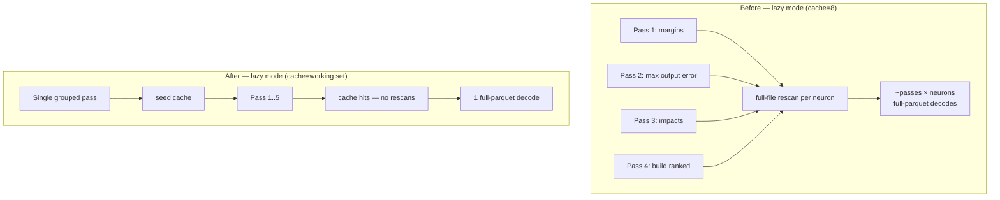

# Lazy focus ranking: single-pass record loading (Issue #1374)

## Summary
In **lazy** focus-ranking mode each neuron's records were re-read from the
parquet file by a **full-file scan**, and the ranking pipeline sweeps every
selectable neuron ~5 times (selectable verification, per-obs margins, max
output error, impacts, ranked-neuron build). The lazy cache held only
`DEFAULT_CACHE_CAPACITY = 8` neurons, so a working set larger than 8 thrashed
into roughly `passes (~5) × neurons × full-parquet-decode` rescans — turning a
7s preload selection into **1h 11m** for the same input (6 neurons from 58
candidates over a 531 MB dataset).

The fix guarantees each neuron's records are materialised **at most once per
ranking run**, even in lazy mode:

1. **Cache sized to the working set** — `LazyRecordProvider::with_capacity`
   sizes the bounded cache to `selectable.len()` so nothing is evicted
   mid-run. Each neuron is therefore loaded at most once across the five
   passes (`O(neurons)`, not `O(passes × neurons)`).
2. **Single grouped warm pass** — `build_lazy_provider` warms the cache with
   one `read_all_records_grouped_by_neuron` decode, retaining only the
   selectable neurons' records via `LazyRecordProvider::seed`. The per-neuron
   loader stays as a fallback for any neuron missing from the warm pass, and
   the sufficiently-sized cache still bounds it to one load per neuron.

This is the issue's preferred fix (options 1 + 2). The change is confined to
`src/focus/ranking/{record_providers.rs, mod.rs}` plus tests.

Closes #1374.

## Evidence

This is a backend/Rust change with no web interface to screenshot. Evidence is
the test suite and the parity/runtime measurement below.

**Runtime:** the end-to-end lazy-vs-preload parity test
(`lazy_mode_matches_preload_mode_numerically`, 16 hidden neurons × 6000
records, lazy mode forced) completes in **~0.45s**, versus the pathological
`1h 11m` described in the issue for the same access pattern.

## Test Plan

Unit tests (`src/focus/tests.rs`):
- `sized_cache_loads_each_neuron_at_most_once_across_passes` — injects a
  counting per-neuron loader via the `with_loader_for_tests` seam, simulates
  5 passes over 20 neurons, and asserts the loader is invoked exactly 20 times
  (`O(neurons)`). Fails against the old 8-entry cache (which thrashes to ~100
  loads).
- `seeded_cache_serves_neurons_without_invoking_loader` — verifies the new
  `seed` warm path serves every neuron from cache (0 per-neuron loads) and
  sorts records by `obs_index`.

Integration test (`tests/focus/issue_1374_lazy_focus_ranking_single_pass.rs`):
- `lazy_mode_matches_preload_mode_numerically` — forces lazy mode via a tiny
  memory budget and asserts the ranked neurons, ordering, and all per-neuron
  scores (`total_error`, `raw_error`, `impact`, `mean_activation`,
  `activation_frequency`) plus `max_output_error` are identical to preload
  mode (numerical parity guard).

All existing focus tests and `./quality.sh` pass (fmt, clippy `-D warnings`,
check, full test suite, release build).
