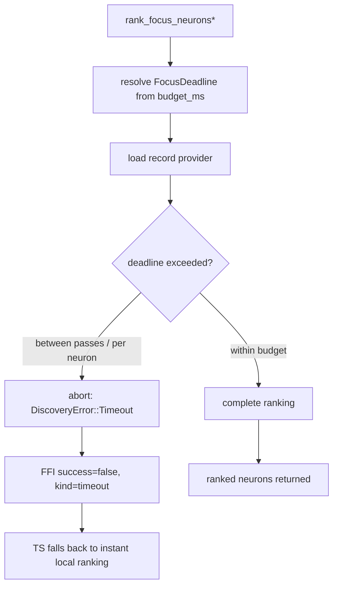

# Enforce a wall-clock budget on focus ranking with graceful fallback

## Summary

Focus ranking previously had **no wall-clock bound**. In the #1373 incident it
ran for **1h 11m** and contributed to the whole discovery task overrunning its
**3h** budget and being killed — while the per-chunk Rust FFI analysis already
aborts at its 2m budget. This change gives focus ranking the same safety net: a
configurable wall-clock budget, checked between passes and inside the per-neuron
loops, that aborts a pathological run with a structured `Timeout` error so the
TypeScript caller falls back to its instant local ranking path instead of
blowing the discovery budget.

Closes #1375.

### What changed (Rust crate `neat_ai_discovery`)

- **New config accessor** `config::focus_ranking_budget_ms()` reading
  `NEAT_AI_DISCOVERY_FOCUS_RANKING_BUDGET_MS`:
  - unset / empty / invalid → default **120000 ms** (2 minutes, mirroring the
    per-chunk FFI budget);
  - `0` → **disabled** (fully unbounded opt-out);
  - any positive integer → that many milliseconds.
  - A fixed **1s grace** (`FOCUS_RANKING_BUDGET_GRACE_MS`) mirrors the per-chunk
    "grace 1s" allowance.
- **Deadline plumbing** in `src/focus/ranking/mod.rs`: a `FocusDeadline` resolves
  the budget at run start and is checked between passes (margins, max-output
  error, impacts, constant-neuron detection) and inside the per-neuron loops
  (record verification and `build_ranked_neurons`). On exceed it returns
  `DiscoveryError::Timeout { deadline_ms }`, which classifies as the retryable
  `Timeout` kind and surfaces to the FFI caller as `success: false` — the same
  shape `tryRustFocusRanking` already routes into its local fallback.
- **Refactor**: the two near-identical public entry points
  (`rank_focus_neurons_with_descriptor` and
  `rank_focus_neurons_with_history_and_descriptor`) now delegate to a single
  shared core (`rank_focus_core` → `rank_selectable`), so the deadline lives in
  one code path. The history-aware sort multiplier is preserved exactly; with no
  history the ordering is byte-for-byte identical to the previous non-history
  path.

The complementary TypeScript wiring (treating a budget-abort like the existing
"unavailable" case) lives in the separate `NEAT-AI` repo's
`FocusSelectionRanking.ts`; the abort already presents as the existing
unavailable/error case, so no behavioural change is required there beyond what is
already in place.

### Flow



## Evidence

Backend/CLI change — no web interface to screenshot. Verified via tests
(`cargo test` exit 0 across the full lib + integration suite) and the full
quality gate (`cargo fmt`, `cargo clippy -D warnings`, `cargo check`,
`cargo doc -D warnings`, release build, `cargo deny check`).

Key behavioural evidence — the regression test injects a deliberately slow
record provider (80 neurons × 25 ms/get ≈ 2 s unbounded) with a 50 ms budget and
asserts the call returns within `budget + grace` with a `Timeout`
classification, well before the unbounded run would finish:

```
test focus::tests::focus_ranking_aborts_when_budget_exceeded ... ok
test focus::tests::focus_ranking_completes_within_generous_budget ... ok
```

## Test Plan

- `src/focus/tests.rs::focus_ranking_aborts_when_budget_exceeded` — slow injected
  provider; asserts abort within `budget + grace`, faster than the unbounded run,
  classified as retryable `Timeout`. Reproduces the #1373 unbounded-run failure.
- `src/focus/tests.rs::focus_ranking_completes_within_generous_budget` — a merely
  slow but legitimate run under a generous budget completes without aborting
  (no false positives; fast/preload behaviour unchanged).
- `tests/focus/issue_1375_focus_ranking_budget.rs` — config accessor: default,
  explicit value, `0` disables, invalid and empty fall back to default.
- Full existing focus suite (149 tests) and full lib + integration suite pass,
  confirming the shared-core refactor preserves ranking behaviour.
