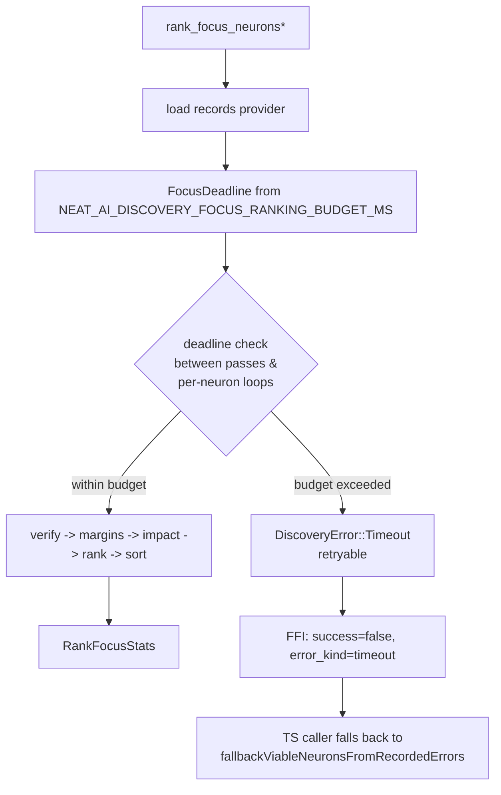

# Enforce a wall-clock budget on focus ranking with graceful fallback (Issue #1375)

## Summary

Focus ranking (`src/focus/ranking/mod.rs`) previously had **no wall-clock
bound**. In the #1373 incident it ran for **1h 11m** and contributed to the
whole discovery task overrunning its **3h** budget and being killed. The
per-chunk Rust FFI analysis already enforces a budget; focus ranking now has the
same safety net.

A pathological focus-ranking run now aborts inside its budget with a structured
`DiscoveryError::Timeout` (classified retryable), so the existing TypeScript
caller routes it into the local-ranking fallback instead of running unbounded.

Closes #1375.

### What changed

- **New env var `NEAT_AI_DISCOVERY_FOCUS_RANKING_BUDGET_MS`** (default
  `120000` = 2 minutes) in `src/config/user_facing.rs`:
  - unset / empty / invalid → default (2 min),
  - `0` → budget disabled (escape hatch),
  - any other value → clamped to `[1000, 3600000]`.
- **Deadline plumbing** in `src/focus/ranking/mod.rs`: a new `FocusDeadline`
  guard is threaded through a shared `rank_focus_neurons_core`. The budget is
  checked between passes and inside the per-neuron loops:
  - on every iteration of the record-verification loop (the load-heavy loop
    where the #1373 incident spent its time under lazy mode),
  - before the margin / max-output-error / impact passes, and
  - inside the parallel `build_ranked_neurons` map.
- On exceed, the run returns `DiscoveryError::Timeout { deadline_ms }`, which
  `error_fields_from_anyhow` classifies as a retryable `timeout` — the same
  shape the controller already treats as "Rust ranking unavailable" and falls
  back from.
- **DRY consolidation:** the history-free and history-aware public entry points
  (`rank_focus_neurons_with_descriptor` /
  `rank_focus_neurons_with_history_and_descriptor`) now funnel through one core
  plus a shared `sort_ranked_neurons` helper, so the budget logic lives in
  exactly one place. Public signatures are unchanged.
- **Test seam:** `rank_focus_neurons_with_provider_and_budget` (doc-hidden,
  public) lets tests inject a custom `RecordProvider` and an explicit budget.

### Fast-path / overhead

Default fast/preload runs are unchanged. The per-neuron check is a single
`Instant::now()` comparison — negligible for the ~58-neuron production case.

## Evidence

Backend/Rust-crate change only — no web interface to screenshot. Verified via
unit/integration tests (below), `cargo clippy --all-targets --all-features -D
warnings` (clean), `cargo doc` (clean), and the full `cargo test --lib` suite
(1087 passed).

### Abort + fallback flow



### Regression test (acceptance criterion)

`tests/focus/issue_1375_focus_ranking_budget.rs::slow_loader_aborts_within_budget_plus_grace`
drives ranking with a deliberately slow injected loader (40 neurons × 50ms/get
≈ a 2s+ unbounded run) under a 200ms budget, and asserts the call:

- returns a `DiscoveryError::Timeout` classified as retryable, and
- returns inside `budget + grace` (well below the unbounded estimate).

```
running 9 tests
test issue_1375_focus_ranking_budget::budget_env_clamps_above_maximum ... ok
test issue_1375_focus_ranking_budget::budget_env_valid_value_is_used ... ok
test issue_1375_focus_ranking_budget::budget_env_zero_disables ... ok
test issue_1375_focus_ranking_budget::budget_env_invalid_falls_back_to_default ... ok
test issue_1375_focus_ranking_budget::budget_env_unset_uses_default ... ok
test issue_1375_focus_ranking_budget::budget_env_clamps_below_minimum ... ok
test issue_1375_focus_ranking_budget::fast_run_completes_with_generous_budget ... ok
test issue_1375_focus_ranking_budget::disabled_budget_does_not_abort ... ok
test issue_1375_focus_ranking_budget::slow_loader_aborts_within_budget_plus_grace ... ok

test result: ok. 9 passed; 0 failed; 0 ignored; 0 measured; 135 filtered out
```

Full focus suite: `144 passed`. Library: `1087 passed`. Integration / analysis /
neuron: `590 / 14 / 45 passed`.

## Test Plan

Added `tests/focus/issue_1375_focus_ranking_budget.rs` (registered in
`tests/focus/main.rs`):

- `slow_loader_aborts_within_budget_plus_grace` — slow injected loader aborts
  inside `budget + grace` with a retryable `Timeout` (the core acceptance
  criterion + regression guard).
- `fast_run_completes_with_generous_budget` — generous budget does not abort a
  fast run; all selectable neurons ranked (no false positives).
- `disabled_budget_does_not_abort` — `budget_ms = None` never aborts.
- `budget_env_*` (6 tests, `#[serial]`) — env parser: default when unset,
  `0` disables, valid value used, clamps below/above bounds, invalid →
  default.

## Notes / scope

- Complementary TS wiring (`tryRustFocusRanking` →
  `fallbackViableNeuronsFromRecordedErrors`) lives in the **NEAT-AI** repo, not
  this crate. The Rust side already returns the structured retryable `timeout`
  error the existing fallback path keys on, so no change is required here.

### Deno regression avoided

Not applicable — this is a Rust crate (no Deno markers); all checks run via
`cargo`.
