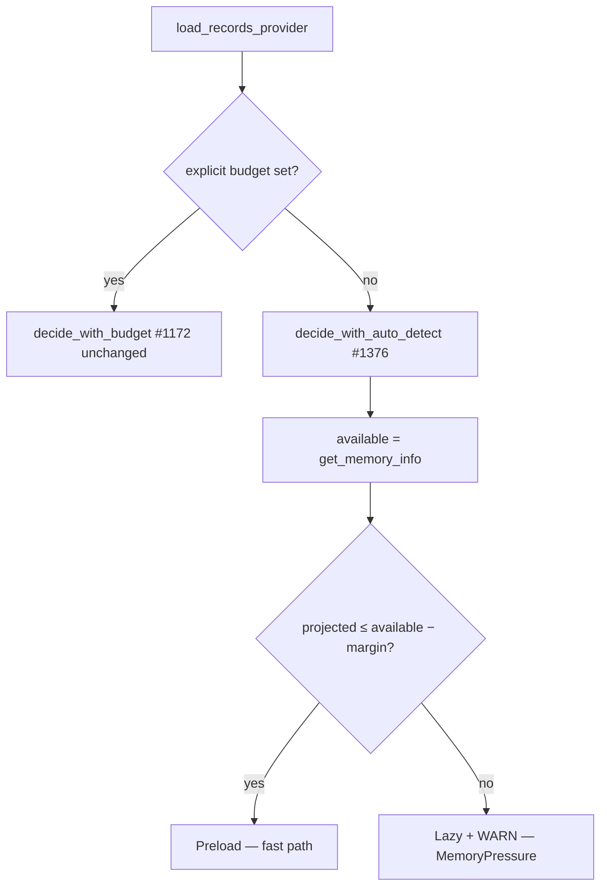

## Summary

The focus-ranking eager-vs-lazy loading decision selected **lazy** (the slow
path) even when GBs of RAM were free. In the GRQ-13 evidence the host had
**~2990 MB available** yet a ~1.6 GB parquet projection was rejected, dropping
the run onto the slow path.

Root cause: the auto-detect (no explicit budget) path called
`check_memory_for_parquet`, whose **50%-of-total-RAM cap** rejected the
projection. When the container reported a small total, a 1.6 GB projection
exceeded 50% of total and fell back to lazy despite ample *available* memory.

This change bases the auto-detect decision on **real OS-available memory minus
a configurable safety margin**: pre-load whenever
`projected ≤ available − margin`. The margin defaults to 1 GB (headroom for GPU
buffers / system / allocator slack) and is overridable via
`NEAT_AI_DISCOVERY_FOCUS_RANKING_MEMORY_MARGIN_MB`. The explicit
`NEAT_AI_DISCOVERY_FOCUS_RANKING_MEMORY_BUDGET_MB` override (#1172) is
**unchanged**.

With the GRQ-13 numbers: `usable = 2990 − 1024 = 1966 MB ≥ 1593 MB → Preload`.

Closes #1376.

### Deno regression avoided

N/A — this is a Rust repository.

## Evidence

Backend/CLI change — no UI to screenshot. Verified via unit and integration
tests calling the real decision helpers with fixed memory figures (including the
GRQ-13 numbers) and through the full `./quality.sh` gate (fmt, clippy, check,
test, release build) passing cleanly.

## Test Plan

Unit tests — `src/analysis/utils/memory_tests.rs` (`parquet_preload_fits_available`):
- `test_preload_fits_when_projection_under_available_minus_margin`
- `test_preload_does_not_fit_when_projection_exceeds_usable`
- `test_preload_fits_grq13_numbers` — ≈1.6 GB projection, ≈3 GB free → Preload
- `test_preload_boundary_equal_fits` — `<=` boundary, one byte over → lazy
- `test_preload_margin_larger_than_available_saturates_to_lazy` — no underflow
- `test_preload_zero_margin_uses_full_available`

Integration tests — `tests/focus/issue_1376_focus_ranking_available_memory.rs`
(`decide_loading_mode_for_available_memory` + `focus_ranking_memory_margin_mb`):
- `grq13_numbers_choose_preload`
- `projection_over_usable_chooses_lazy_memory_pressure`
- `boundary_equal_to_usable_preloads`
- `margin_exceeding_available_falls_back_to_lazy_without_panic`
- `margin_config_unset_uses_default` / `_honours_override` / `_honours_zero` /
  `_invalid_falls_back_to_default`

Regression guards (unchanged, still pass):
- `tests/focus/issue_1172_focus_ranking_memory_budget.rs` (7 tests)
- `tests/ffi/issue_1028_memory_budget.rs` (11 tests)
