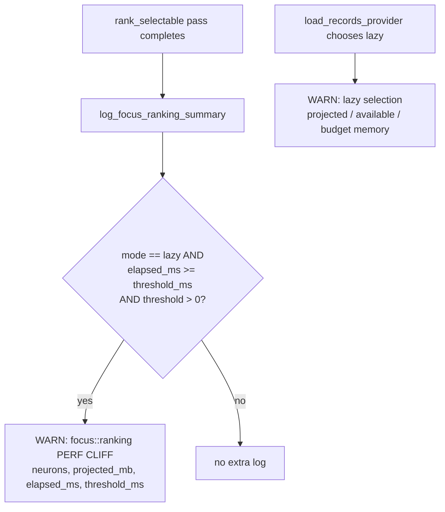

## Summary

Make focus-ranking **mode** and **Rust elapsed** first-class in the timing
breakdown, and make the lazy-mode perf cliff loud, so the next #1373-style
incident (a lazy ranking pass running for 1h 11m) is one log line instead of a
forensic exercise. Closes #1377.

This is the Rust-side, observability-only slice of the work. The FFI fields the
TypeScript `Focus selection breakdown` line consumes — `loadingMode`,
`lazyReason`, `budgetMb`, `projectedMb`, and Rust `durationMs` (elapsed) — were
already plumbed across the boundary on `RankFocusNeuronsOutput` (Issue #1172).
This change closes the two remaining Rust-side gaps:

1. **Explicit perf-cliff `WARN`.** A *lazy* focus-ranking pass that reaches the
   configured threshold (default 60s, below the #1375 120s wall-clock budget)
   now emits one clearly-labelled `focus::ranking PERF CLIFF` warning naming the
   neuron count, projected dataset size, elapsed, and threshold, plus the likely
   remedy (raise the memory budget or free host memory to re-enable preload).
   New env var `NEAT_AI_DISCOVERY_FOCUS_RANKING_PERF_CLIFF_MS` (`0` disables).
2. **Enriched lazy-selection logs.** Both lazy-mode *selection* logs now record
   projected / available / budget memory at the decision point. The budget-path
   log is escalated from `info` to `warn` and gains available memory; the
   auto-detect path log gains a uniform `budget_mb` field.

No behavioural change to ranking results — logging and one new config accessor
only.

## Evidence

Backend/library change with no web interface to screenshot. Verified via the
test suite (full `cargo test --lib --tests --all-features` passed: 0 failures)
and the new targeted tests below.

### Flow

## Test Plan

New `tests/focus/issue_1377_focus_ranking_perf_cliff.rs` (registered in
`tests/focus/main.rs`):

- `lazy_pass_exceeds_perf_cliff` pure decision — over / at / under threshold,
  preload never trips, `0` threshold disables.
- `focus_ranking_perf_cliff_ms` accessor — default (60000), explicit override,
  `0` opt-out, invalid and empty fall back to default.

Regression coverage: existing focus suite (159 tests) and the whole library +
integration suite pass unchanged.
