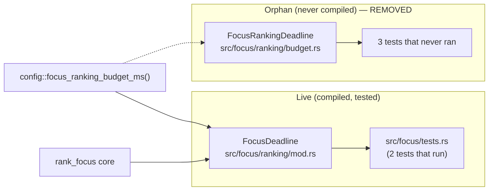

## Summary

Removed the orphaned (uncompiled) dead duplicate `src/focus/ranking/budget.rs`. Closes #1384.

`budget.rs` defined a `FocusRankingDeadline` wall-clock guard — its header read
*"Wall-clock budget enforcement for focus ranking (Issue #1375)"* — complete
with three unit tests. **The file was never compiled.** No `mod budget;`
declaration or `#[path]` include referenced it anywhere in the crate
(`src/focus/ranking/mod.rs`, `src/focus/mod.rs`, `src/lib.rs`, `build.rs`), and
`FocusRankingDeadline` appeared only inside that one file. Its tests
(`disabled_budget_never_aborts`, `future_deadline_does_not_abort`,
`elapsed_budget_aborts_with_timeout_error`) never ran, giving false confidence
that the budget path was covered.

The live, wired-in implementation is the separate `FocusDeadline` type in
`src/focus/ranking/mod.rs` (defined at `:162`, constructed via
`FocusDeadline::from_config`/`::new`, enforced through `check_deadline(...)`),
already exercised by `src/focus/tests.rs`. Per the issue's "pick one home"
guidance, the orphan was deleted so the crate keeps exactly one focus-ranking
deadline implementation, with no behavioural change.

The shared `config::focus_ranking_budget_ms()` accessor is retained — it remains
in use by the live `FocusDeadline::from_config` (`src/focus/ranking/mod.rs:184`),
so deleting the orphan left no newly-dead config.

### Verification of orphan status

```
grep -rn "mod budget" src/                 → no matches
grep -rn "path *=.*budget" src/            → no matches
grep -rn "FocusRankingDeadline" src/       → only the deleted file
grep -rn "FocusDeadline" src/focus/ranking/mod.rs → live, wired-in path
```

### Live vs orphan before this change



## Evidence

Backend/Rust-only change — no web interface to screenshot. Verified via the
existing tests that exercise the surviving `FocusDeadline` and the full quality
gate.

- `./quality.sh` → **All quality checks passed** (build, `cargo fmt`, Clippy with
  `-D warnings`, `cargo check`, full test suite, doc build, release build).
- The live deadline tests pass:

```
test focus::tests::focus_ranking_completes_within_generous_budget ... ok
test focus::tests::focus_ranking_aborts_when_budget_exceeded ... ok
test result: ok. 2 passed; 0 failed
```

## Test Plan

No new tests required — this is pure dead-code removal. The surviving behaviour
(default 120s budget, graceful retryable `Timeout` abort) stays covered by the
existing, actually-running cases in `src/focus/tests.rs`:

- `focus_ranking_aborts_when_budget_exceeded`
- `focus_ranking_completes_within_generous_budget`

No existing tests were modified or removed (the deleted tests were the orphan's
own, which never compiled or ran).
