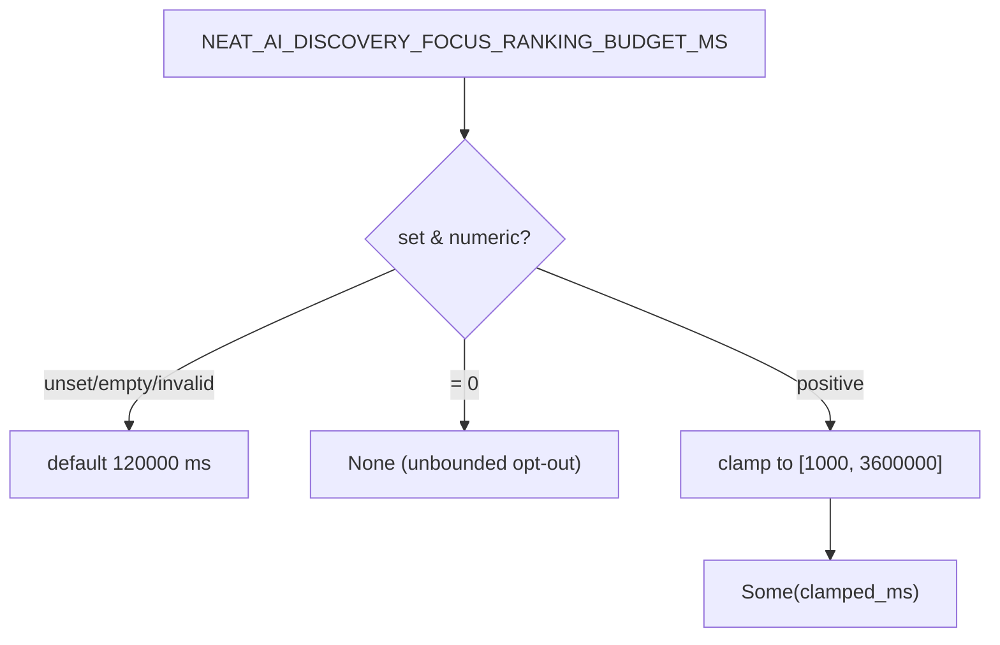

## Summary

Reconciled the focus-ranking budget clamp so the implementation matches the
documented contract. The README and `config` docs promised that
`NEAT_AI_DISCOVERY_FOCUS_RANKING_BUDGET_MS` values *"clamp to `[1000, 3600000]`"*,
but `focus_ranking_budget_ms()` returned any positive `u64` verbatim. A
misconfigured tiny value (e.g. `5`) would abort focus ranking after a few
milliseconds on every run (silently degrading every creature to the fallback
path), and a huge value (e.g. `999999999`) effectively restored the unbounded
behaviour Issue #1375 set out to prevent.

The recommended fix was applied: `focus_ranking_budget_ms()` now clamps a parsed
positive value to `[FOCUS_RANKING_BUDGET_MIN_MS, FOCUS_RANKING_BUDGET_MAX_MS]`
(`1_000..=3_600_000`), emitting a `debug` log when a value is clamped so
misconfiguration is visible. The `0` → `None` opt-out and the 120 s default are
preserved. Two bound constants were added next to
`DEFAULT_FOCUS_RANKING_BUDGET_MS`.

Closes #1385.

## Behaviour



## Evidence

Backend/config-only change — no web interface to screenshot. Verified via unit
tests on `focus_ranking_budget_ms()` and the full `./quality.sh` gate (fmt,
clippy, check, test, release build) which passes cleanly.

Test run:

```
running 9 tests
test issue_1375_focus_ranking_budget::above_max_budget_clamps_down_to_max ... ok
test issue_1375_focus_ranking_budget::below_min_budget_clamps_up_to_min ... ok
test issue_1375_focus_ranking_budget::max_boundary_is_used_verbatim ... ok
test issue_1375_focus_ranking_budget::min_boundary_is_used_verbatim ... ok
test issue_1375_focus_ranking_budget::explicit_budget_is_honoured ... ok
... (9 passed; 0 failed)
```

## Test Plan

In `tests/focus/issue_1375_focus_ranking_budget.rs`, covering the acceptance
criteria:

- `unset_budget_defaults_to_a_few_minutes` — unset → default (existing).
- `invalid_budget_falls_back_to_default` — invalid → default (existing).
- `empty_budget_falls_back_to_default` — empty → default (existing).
- `zero_budget_disables_the_bound` — `0` → `None` (existing).
- `explicit_budget_is_honoured` — in-range `5000` used verbatim (existing).
- `below_min_budget_clamps_up_to_min` — `5` → `1000` (new).
- `above_max_budget_clamps_down_to_max` — `999999999` → `3600000` (new).
- `min_boundary_is_used_verbatim` — `1000` → `1000` (new).
- `max_boundary_is_used_verbatim` — `3600000` → `3600000` (new).

## Files Changed

- `src/config/user_facing.rs` — added `FOCUS_RANKING_BUDGET_MIN_MS` /
  `FOCUS_RANKING_BUDGET_MAX_MS` constants and the clamp (with a `debug` log)
  in `focus_ranking_budget_ms()`.
- `src/config/mod.rs` — env-var doc row now notes the clamp.
- `tests/focus/issue_1375_focus_ranking_budget.rs` — added the four clamp tests.

The README env-var row already documented the `[1000, 3600000]` clamp, so the
code change brings the implementation into agreement with the docs; no README
line needed changing.
