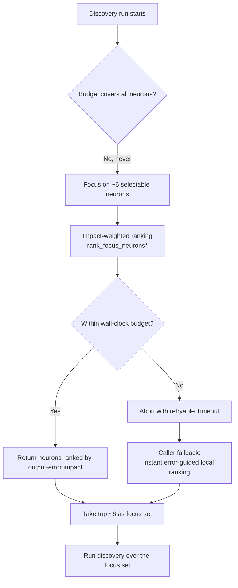

## Summary

Documented the **focus-selection design end-to-end** in one discoverable place so
the next "please confirm my understanding of the focus logic" request is a doc
link rather than a code spelunk. Documentation-only — no code change. Closes #1386.

- Added [`docs/FOCUS_SELECTION.md`](../../FOCUS_SELECTION.md) covering all five
  points from the issue:
  1. **Why a focus subset** — discovery cannot evaluate every neuron within the
     run budget, so each run focuses on ~6 selectable neurons.
  2. **Selection history** — random pick → impact-weighted ranking
     (`rank_focus_neurons*`, `src/focus/`) scoring neurons by estimated output-error
     impact.
  3. **Performance guard** — wall-clock budget (#1375), single-pass loading
     (#1374), available-memory eager/lazy decision (#1376, #1172), perf-cliff
     observability (#1377); incident #1373 (1 h 11 m) context.
  4. **Fallback** — on budget abort the crate returns a retryable `Timeout` and the
     caller falls back to its **instant, error-guided** local ranking, stated
     explicitly as *not* a literal uniform-random pick. The literal-random-vs-
     error-guided confirmation is recorded as an **open author question** (see
     below) per the acceptance criteria.
  5. **Env knobs** — links the existing `NEAT_AI_DISCOVERY_FOCUS_RANKING_*` rows.
- Added a short **🎯 Focus Selection** section to `README.md` summarising the
  design and linking the new doc, plus an Additional Documentation table row.

### Fallback semantics — author confirmation (open)

The implemented fallback is **error-guided and instant** (ranks viable neurons
from recorded errors), which is at least as good as random and equally fast. The
issue asks whether this satisfies the original *"just do a random selection"*
intent or whether a literal random fallback is required. This is a product
decision for the author; the doc states the semantics explicitly and flags the
question, and a comment has been posted on Issue #1386 requesting confirmation.
The doc will be updated with the answer once recorded.

## Evidence

Backend/documentation-only change — no web interface to screenshot.

- `markdownlint-cli2 docs/FOCUS_SELECTION.md README.md` → **0 errors** (61 files
  linted).
- No Rust source touched, so the Rust quality gates (clippy/check/test/build) are
  unaffected.

End-to-end focus-selection flow documented in the new doc:

## Test Plan

No automated tests — the change is documentation only (no public functions added
or modified). Validation performed:

- `markdownlint-cli2` on the new doc and README — passes with 0 errors.
- Manual review that every module/issue reference resolves
  (`src/focus/ranking/mod.rs`, `docs/IMPACT_CALCULATION.md`, env-var rows in
  `README.md`).
